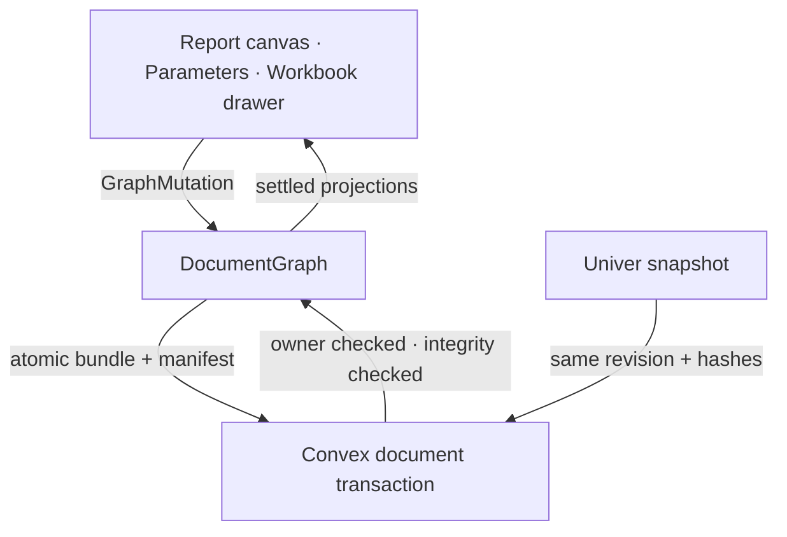

# OctoMeta architecture

*What is built and which layer owns each decision. Forward-looking work lives
in [IMPLEMENTATION_PLAN.md](IMPLEMENTATION_PLAN.md).*

**Last updated:** 20 July 2026
**Current release:** R1.6 workbench implemented and locally release-verified

## Product shape

Each owned document has two coordinated surfaces:

- a TipTap report canvas containing text, headings, images, equations, and live
  value chips;
- one attached Univer workbook containing stable, named tabs.

They are not peer data stores. `DocumentGraph` is authoritative for values,
formulas, dependencies, published names, report structure, workbook manifest,
undo/redo, and provenance. TipTap and Univer are projections. Univer stores
settled display values with formula fields cleared, so it cannot become a
second calculation engine.



## Ownership boundaries

| State or behavior | Owner | Consumers |
|---|---|---|
| Typed values, formulas, errors, dependencies | `src/lib/engine/` | cells, chips, equations, rail |
| Published aliases and one-hop target resolution | `DocumentGraph` | parameters, equations, names |
| Report block order and payload | `DocumentGraph` | TipTap |
| Workbook tab ID, name, order | `DocumentGraph.workbook` | custom tab strip, Univer |
| Cell identity | `CellRef { sheetId, a1 }` | graph and adapter |
| Workbook visual/cell snapshot | Univer adapter | atomic persistence bundle |
| Undo/redo | engine history | report, cells, names, tabs |
| Identity and document ownership | Better Auth + Convex | route gate and every product operation |
| Save revision, hashes, limits | Convex | persistence facade |
| Files and reachability state | Convex assets/storage | image blocks |

## Runtime flow

1. `/app/[docId]` loads the owned document through the persistence facade.
2. Convex distinguishes live, trashed, missing, unauthorized, and
   integrity-failed states before an editable surface mounts.
3. `hydrateGraph` validates bundle and workbook hashes, reconstructs the graph,
   and re-evaluates it.
4. TipTap becomes editable. `WorkbookDrawer` mounts exactly one Univer
   instance and reconciles the typed tab manifest.
5. A cell/pill/report/tab edit commits one `GraphMutation`; recalc settles the
   affected dependency subgraph.
6. All projections repaint from settled graph values. The saver writes graph
   rows, manifest, snapshot, stats, revision, and hashes in one CAS mutation.
7. A stale revision or integrity mismatch fails closed and never blind-retries.

All sheet callbacks capture the immutable event-time `SheetId`. Active-tab
state is presentation state only and is never used to infer cell ownership.

## Code map

```text
src/
  convex/
    auth.ts, auth.config.ts       Better Auth component and providers
    documents.ts                  owner-scoped lifecycle + atomic bundle save
    files.ts, assetClaims.ts      validated upload claims and durable cleanup
    maintenance.ts                guarded development/test reset
    schema.ts                     product, asset, maintenance, waitlist tables
  lib/
    engine/                       pure typed graph, formulas, units, history
    adapters/univer/
      workbook-adapter.ts         one document ↔ one Univer workbook
      univer-api.ts               only runtime @univerjs imports
      graph-sync.ts               graph commit/settle bridge
      cell-text.ts                edit classification and display mapping
    editor/
      create-editor.ts            TipTap assembly and one engine history
      block-chrome.ts             uniform move/remove controls
      equation-node.ts            safe static/bound KaTeX node view
      chip-node.ts                live values, edit, steps, deep-links
    persistence/
      client.ts                   only UI-facing Convex facade
      serialize.ts, canonical.ts  bundle codec, hashes, integrity validation
      saver.ts                    debounced, non-overlapping CAS saves
      fixtures.ts                 real-commit demo/reproducibility fixtures
    components/UserBadge.svelte   authenticated account control
  routes/
    signin/                       email/password, magic link, optional Google
    app/+layout.server.ts         route gate
    app/+page.svelte              live/trash list, bulk lifecycle actions
    app/[docId]/                  report shell, parameters, workbook drawer
    api/auth/[...all]/            Better Auth SvelteKit proxy
```

Third-party boundaries are enforced by tests:

- runtime `@univerjs` imports stay in `src/lib/adapters/univer/univer-api.ts`;
- TipTap/ProseMirror stays in `src/lib/editor/`;
- UI code reaches `convex`/`convex-svelte` only through
  `src/lib/persistence/`.

## Engine and workbook conventions

- `CellRef` is `{ sheetId, a1 }`; display names and positions are never
  identities.
- `workbookOp add|rename|remove` is validated and undoable. The final tab
  cannot be removed; undo restores the stable ID and captured projection.
- Published-name rename preserves the alias node ID and rewrites dependents in
  one history entry.
- Cross-tab calculation uses published dotted names. `Sheet!A1` and structural
  row/column operations remain deferred.
- Quantities store canonical SI magnitude plus a preferred display. R1 supports
  the locked imperial vocabulary (`in`, `ft`, `lbf`, `kip`, `psi`, `ksi`) and
  shared compound formatting such as `in²`.
- Derivations are structured engine data. Text and TeX renderers consume the
  structure; rendered strings are never parsed back into math.
- Error chips with a cell origin open the workbook, activate the exact tab,
  select the exact A1 cell, and keep a return-focus path.

## Editor conventions

The report union is exactly `text | heading | image | equation`; spreadsheet
blocks no longer exist in TipTap. Every top-level node carries a stable
`blockId`. Structural edits commit synchronously through `blockOp`; prose
payload changes are debounced. TipTap history is disabled because engine
history is the one history shared with workbook edits.

Equation blocks are either:

```ts
{ mode: 'static'; tex: string }
{ mode: 'bound'; nodeId: NodeId; display: 'symbolic'|'substituted'|'result'|'steps' }
```

KaTeX runs with trust disabled, strict input/complexity limits, an accessible
MathML representation, and a last-known-good preview for invalid input.

## Persistence and security

Every product query/mutation is authenticated and owner-scoped. New documents
atomically receive one tab and revision zero. Saves enforce count/byte caps,
validate referenced assets, compare the expected revision, and replace the
entire document bundle in one transaction. Load verifies both snapshot and
bundle hashes before returning an editable state.

Assets are claimed only after MIME, signature, size, ownership, and document
checks. Reachability includes live blocks and retained undo. Unreachable files
enter a durable `pendingDeletion` retry state before storage and metadata are
removed.

Trash is recoverable for 30 days. Permanent delete and scheduled expiry cascade
all product rows and assets. The administrative reset:

- is absent from browser persistence;
- accepts only `development` or `test`;
- requires a deployment-specific secret and exact backup acknowledgement;
- counts/deletes a hardcoded product allowlist;
- locks all product writes;
- deletes in bounded stages;
- unlocks only after zero-row verification;
- leaves the lock held on failure.

Better Auth supports email/password and magic links, with optional Google OAuth.
SvelteKit gates `/app`; Convex remains the authoritative security boundary.

## Delivery and operations

The app uses the Vercel adapter. Fonts are self-hosted; CSP limits the Univer
embedded icon font's `data:` allowance to `font-src`. Security headers include
nosniff, strict referrer policy, restricted permissions, same-origin resource
policy, and frame/object restrictions.

GitHub CI installs from the frozen pnpm lockfile and runs types, all Vitest
projects, production build, dependency audit, secret scan, and Playwright. The
manual protected production workflow repeats every gate before Convex and
Vercel deployment.

## Verification baseline

- Vitest covers engine, adapter mapping, editor behavior, bundle
  reproducibility, owner isolation, limits, asset lifecycle, and reset safety.
- Playwright covers the complete steel demo, exact error navigation,
  tab/name/history behavior, reload, trash/restore, signed-out gating,
  malicious/invalid TeX, narrow layout, CSP console cleanliness, and axe.
- The production build is the browser-test artifact.
- Known operational constraint: production deployment requires the protected
  environment credentials and a separate production Convex configuration; the
  implementation does not substitute development credentials.

## Deferred

Viewer/geometry, charts, PDF/IFC export, templates, sharing/teams/ACLs,
collaboration, full account settings, unit picker UI, `Sheet!A1`, structural
spreadsheet commands, and offline reload caching remain outside R1.6.
