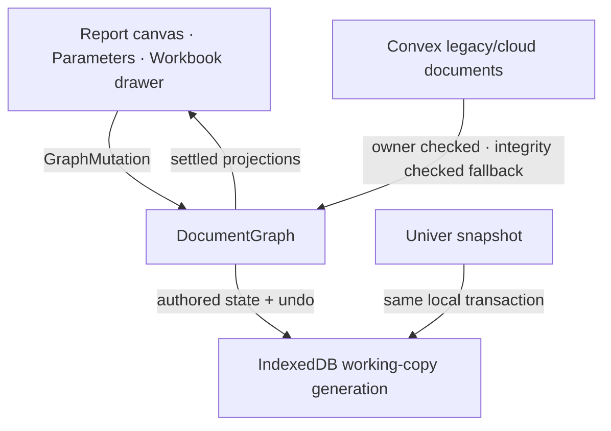

# OctoMeta architecture

*What is built and which layer owns each decision. Forward-looking work lives
in [IMPLEMENTATION_PLAN.md](IMPLEMENTATION_PLAN.md).*

**Last updated:** 23 July 2026
**Current release:** R1.6 workbench with browser-local durability implemented and locally verified

## Product shape

Each owned document has two coordinated surfaces:

- a TipTap report canvas containing text, headings, images, equations, and live
  value chips;
- one attached Univer workbook containing stable, named tabs.

They are not peer data stores. `DocumentGraph` is authoritative for values,
formulas, dependencies, published names, report structure, workbook manifest,
undo/redo, and provenance. TipTap and Univer are projections. Univer stores
settled display values with formula fields cleared, so it cannot become a
second calculation engine.



## Ownership boundaries

| State or behavior | Owner | Consumers |
|---|---|---|
| Typed values, formulas, errors, dependencies | `src/lib/engine/` | cells, chips, equations, rail |
| Published aliases, metadata, use disclosure, and one-hop target resolution | `DocumentGraph` | manager, references, equations |
| Report block order and payload | `DocumentGraph` | TipTap |
| Workbook tab ID, name, order | `DocumentGraph.workbook` | custom tab strip, Univer |
| Cell identity | `CellRef { sheetId, a1 }` | graph and adapter |
| Workbook visual/cell snapshot | Univer adapter | atomic persistence bundle |
| Undo/redo | engine history | report, cells, names, tabs |
| Working copy generation and local durability | IndexedDB | document index and workbench |
| Unified local/cloud index state | `src/lib/workspace/document-index.ts` | document list |
| Account identity and cloud ownership | Better Auth + Convex | route gate and cloud operations |
| Product document/workspace identity | Application-generated IDs | graph, IndexedDB, route |
| Save revision, hashes, limits | Convex | persistence facade |
| Immutable Main versions and snapshot chunks | Convex | explicit Save new version flow |
| Files and reachability state | Convex assets/storage | image blocks |

## Runtime flow

1. `/app/[docId]` first acquires the account/document/workspace Web Lock.
   A lock holder may edit; another tab and browsers without safe locking load
   read-only. Cooperative takeover flushes the owner before lock release.
2. The route loads the authenticated account's IndexedDB `main`
   working copy. A cloud-backed document without a local copy is read once and
   committed locally before the editable surface mounts. That first generation
   records the cloud base revision and hash; later generations make local-change
   state observable without a cloud write.
3. New documents are application-ID local records; creation sends no Convex
   product mutation. Convex still distinguishes live, trashed, missing,
   unauthorized, and integrity-failed states for cloud fallback reads.
4. `hydrateGraph` reconstructs the graph from the local generation and
   re-evaluates it.
5. TipTap becomes editable only for the lease owner. `WorkbookDrawer` mounts exactly one Univer
   instance and reconciles the typed tab manifest.
6. A cell/pill/report/tab edit commits one `GraphMutation`; recalc settles the
   affected dependency subgraph.
7. All projections repaint from settled graph values. Local autosave coalesces
   for 500 ms, enforces a 2-second maximum dirty interval, and commits authored
   state, workbook snapshot, and unified undo state in one IndexedDB transaction.
8. Expected-generation compare-and-swap fences stale writers. A failed
   transaction preserves the prior generation and keeps the device-save error
   visible until a later transaction succeeds.
9. A service worker serves shipped assets and previously visited owner routes
   during offline reload. A remembered device owner resolves the same
   account-scoped IndexedDB namespace; reconnect performs no publication.
10. **Save new version** flushes one durable generation, stages its exact
    operation ID/input hash locally, then creates version 1 or the next
    expected-head-fenced Main version. Acknowledgement advances only that
    captured generation's cloud base, so newer local edits remain dirty.

All sheet callbacks capture the immutable event-time `SheetId`. Active-tab
state is presentation state only and is never used to infer cell ownership.

## Code map

```text
src/
  convex/
    auth.ts, auth.config.ts       Better Auth component and providers
    documents.ts                  owner-scoped lifecycle + legacy bundle compatibility
    documentVersions.ts           immutable Main versions + verified snapshot chunks
    files.ts, assetClaims.ts      validated upload claims and durable cleanup
    maintenance.ts                guarded development/test reset
    schema.ts                     product, asset, maintenance, waitlist tables
  lib/
    engine/                       pure typed graph, formulas, units, history
    adapters/univer/
      workbook-adapter.ts         one document ↔ one Univer workbook
      univer-api.ts               only runtime @univerjs imports
      graph-sync.ts               graph commit/settle bridge
      cell-text.ts                edit classification and display mapping
    editor/
      create-editor.ts            TipTap assembly and one engine history
      block-chrome.ts             uniform move/remove controls
      equation-node.ts            safe static/bound KaTeX node view
      chip-node.ts                live values, edit, steps, deep-links
    persistence/
      client.ts                   only UI-facing Convex facade
      serialize.ts, canonical.ts  bundle codec, hashes, integrity validation
      local/repository.ts         IndexedDB generations + per-workspace summaries
      cloud-version.ts            review model + retry-safe explicit-save controller
      local/autosave.ts           500 ms trailing / 2 s maximum local save queue
      local/serialization.ts      distinct local authored + history envelope
      workbook-snapshot.ts        shared empty-workbook snapshot factory
      saver.ts                    retained legacy cloud saver utility
      fixtures.ts                 real-commit demo/reproducibility fixtures
    workspace/document-index.ts   grouped local/cloud/branch index model
    components/UserBadge.svelte   authenticated account control
  routes/
    signin/                       email/password, magic link, optional Google
    app/+layout.server.ts         route gate
    app/+page.svelte              live/trash list, bulk lifecycle actions
    app/[docId]/                  report shell, published-values manager, workbook drawer
    api/auth/[...all]/            Better Auth SvelteKit proxy
```

Third-party boundaries are enforced by tests:

- runtime `@univerjs` imports stay in `src/lib/adapters/univer/univer-api.ts`;
- TipTap/ProseMirror stays in `src/lib/editor/`;
- UI code reaches `convex`/`convex-svelte` only through
  `src/lib/persistence/`.

## Engine and workbook conventions

- `CellRef` is `{ sheetId, a1 }`; display names and positions are never
  identities.
- `workbookOp add|rename|remove` is validated and undoable. The final tab
  cannot be removed; undo restores the stable ID and captured projection.
- Published-name rename preserves the alias node ID and rewrites dependents in
  one history entry.
- Published-value label, unit, and description live on the stable alias and
  persist with the graph. Document chips and Equation bindings store the alias
  ID; Workbook defined names are a best-effort projection of authoritative
  graph mutations.
- Unpublish review derives uses from graph dependents, chip bindings, and
  Equation payloads. Confirmed removal retains those consumer identities so
  they render as explicit, repairable broken references.
- Cross-tab calculation uses published dotted names. `Sheet!A1` and structural
  row/column operations remain deferred.
- Quantities store canonical SI magnitude plus a preferred display. R1 supports
  the locked imperial vocabulary (`in`, `ft`, `lbf`, `kip`, `psi`, `ksi`) and
  shared compound formatting such as `in²`.
- Derivations are structured engine data. Text and TeX renderers consume the
  structure; rendered strings are never parsed back into math.
- Error chips with a cell origin open the workbook, activate the exact tab,
  select the exact A1 cell, and keep a return-focus path.

## Editor conventions

The report union is exactly `text | heading | image | equation`; spreadsheet
blocks no longer exist in TipTap. Every top-level node carries a stable
`blockId`. Structural edits commit synchronously through `blockOp`; prose
payload changes are debounced. TipTap history is disabled because engine
history is the one history shared with workbook edits.

Equation blocks are either:

```ts
{ mode: 'static'; tex: string }
{ mode: 'bound'; nodeId: NodeId; display: 'symbolic'|'substituted'|'result'|'steps' }
```

KaTeX runs with trust disabled, strict input/complexity limits, an accessible
MathML representation, and a last-known-good preview for invalid input.

## Persistence and security

Every product query/mutation is authenticated and owner-scoped. New documents
atomically receive one tab and revision zero. Saves enforce count/byte caps,
validate referenced assets, compare the expected revision, and replace the
entire document bundle in one transaction. Load verifies both snapshot and
bundle hashes before returning an editable state.

The browser repository stores one summary per `accountId + documentId +
workspaceId`. Main and branch summaries therefore remain independently
addressable while the document-index model groups them beneath one parent.
Local duplicate and discard transactions touch IndexedDB only. Save/export
controls are explicit non-mutating entry points until their dedicated
cloud-version and portable-file workflows replace them.

Assets are claimed only after MIME, signature, size, ownership, and document
checks. Reachability includes live blocks and retained undo. Unreachable files
enter a durable `pendingDeletion` retry state before storage and metadata are
removed.

Trash is recoverable for 30 days. Permanent delete and scheduled expiry cascade
all product rows and assets. The administrative reset:

- is absent from browser persistence;
- accepts only `development` or `test`;
- requires a deployment-specific secret and exact backup acknowledgement;
- counts/deletes a hardcoded product allowlist;
- deletes root file storage, including orphaned legacy objects, while leaving
  Better Auth and Resend component storage untouched;
- locks all product writes;
- deletes in bounded stages;
- unlocks only after zero-row verification;
- leaves the lock held on failure.

Better Auth supports email/password and magic links, with optional Google OAuth.
SvelteKit gates `/app`; Convex remains the authoritative security boundary.

## Delivery and operations

The app uses the Vercel adapter. Fonts are self-hosted; CSP limits the Univer
embedded icon font's `data:` allowance to `font-src`. Security headers include
nosniff, strict referrer policy, restricted permissions, same-origin resource
policy, and frame/object restrictions.

GitHub CI installs from the frozen pnpm lockfile and runs types, all Vitest
projects, production build, dependency audit, secret scan, and Playwright. The
manual protected production workflow repeats every gate before Convex and
Vercel deployment.

## Verification baseline

- Vitest covers engine, adapter mapping, editor behavior, bundle
  reproducibility, owner isolation, limits, asset lifecycle, and reset safety.
- Playwright covers the complete steel demo, exact error navigation,
  tab/name/history behavior, reload, trash/restore, signed-out gating,
  malicious/invalid TeX, narrow layout, CSP console cleanliness, and axe.
- The production build is the browser-test artifact.
- Known operational constraint: production deployment requires the protected
  environment credentials and a separate production Convex configuration; the
  implementation does not substitute development credentials.

## Deferred

Viewer/geometry, charts, PDF/IFC export, templates, sharing/teams/ACLs,
collaboration, full account settings, unit picker UI, `Sheet!A1`, structural
spreadsheet commands, and offline reload caching remain outside R1.6.
