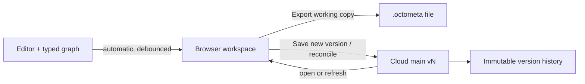

# Browser-First, Versioned Persistence

## What We're Building

Replace per-edit cloud persistence with a browser-first document workspace and
an explicit, immutable cloud-version model.

The browser is the primary editing environment. Every accepted edit is saved
automatically to a device-local working copy. The owner can edit `main`
directly, create named experimental branches, work offline, export a portable
document, and deliberately create a new cloud version. Shared users are
read-only in the first release of this model.

The system has three distinct durability layers:

1. **Browser workspace** — automatic IndexedDB persistence for document state,
   local branches, undo/redo history, and not-yet-uploaded assets.
2. **Portable document** — a user-controlled `.octometa` file that can restore
   the document even if browser storage is lost.
3. **Cloud main history** — immutable, complete document snapshots created only
   by an explicit owner action.

Convex remains the authenticated cloud control plane for document metadata,
access rights, immutable versions, assets, and later collaboration. It is no
longer the live keystroke persistence engine.



## Why the Architecture Is Changing

### Immediate incident: runaway scheduled cleanup

The allowance exhaustion was caused primarily by
`src/convex/documents.ts::purgeExpired`.

The function queries the optional `deletedAt` field with
`deletedAt < cutoff`. Convex orders a missing value (`undefined`) before every
number, so live documents are inside that range. The function then schedules
itself immediately whenever the raw query returns 25 rows, even if none are
actually expired.

The current development deployment contained 35 live documents and one
trashed document, satisfying the recurrence condition indefinitely. A sampled
500 deployment-log records were all `documents:purgeExpired`, reading 12,450
documents and 7.97 MB while performing no useful writes. A 100-record window
spanned approximately 1.34 seconds. At that observed rate, the current 1 GB
free database-I/O allowance could be exhausted in minutes if the workload were
allowed to continue.

This is an acute correctness defect and must be fixed independently of the
broader persistence redesign.

### Structural issue: per-edit full replacement

The normal save path is also unsuitable for the product's next phase:

- `src/lib/persistence/saver.ts` schedules a cloud save after only 500 ms of
  quiet.
- `src/lib/persistence/client.ts` serializes the complete graph, complete undo
  history, workbook manifest, and complete workbook snapshot.
- `src/convex/documents.ts::save` reads all assets, reads and deletes every
  graph node, block, chip, and undo entry, reinserts all of them, rewrites the
  workbook snapshot, and patches the document header.
- Workbook model changes, editor changes, graph commits, undo/redo, parameters,
  and several projection callbacks all schedule the same full save.

The current dataset already contains 1,976 graph/history child rows across 36
documents. Normal editing therefore scales cloud work with total document size
instead of the user's deliberate durability decisions.

This behavior was intentionally accepted as a first implementation in
`IMPLEMENTATION_PLAN.md` under “optimize when it hurts.” It now hurts, and the
product model has become clear enough to replace it.

## Product Model

### Main

`main` is the authoritative cloud lineage for one document.

- The document owner may open and edit main normally.
- Editing occurs in a device-local **main working copy** based on a specific
  immutable cloud version.
- An explicit **Save new version** action validates the working copy, creates
  the next immutable cloud version, and advances the main pointer atomically.
- Cloud main is never mutated in place and its pointer never moves backwards.
- If another device advances main first, the stale working copy cannot
  overwrite it; it becomes divergent and requires reconciliation.
- A viewer may open main read-only but cannot create or advance versions.

### Branch

A branch is an explicit experimental working copy associated with the same
document.

- It has a stable local branch ID and user-visible name.
- It records the immutable main version from which it originated.
- It persists in the browser and works offline.
- It has its own local undo/redo history and local assets.
- It may be exported, discarded, or reconciled with main.
- It does not receive a cloud version number merely because it changed.
- Reconciliation creates a new immutable main version; it never mutates an
  existing version.

Branches are device-local in the first release. A portable export is the
user-controlled backup and transfer mechanism for unfinished branches. Cloud
branch backup can be added later without changing main-version semantics.

### Duplicate document

**Duplicate document** is deliberately separate from **Create branch**.

- A duplicate receives a new document identity.
- It starts an independent main history at version 1.
- It has independent ownership, access rights, trash, and lifecycle.
- It is not automatically reconcilable with the source document.
- It may retain informational provenance such as “Duplicated from document X,
  version 12.”

The product should not use the ambiguous label “Create a copy.”

### History and restoration

- Every cloud version is immutable and monotonically numbered within its
  document.
- Opening an older version is read-only.
- The owner may create a branch from an older version.
- “Restore version” copies the old content into a new head version; it does not
  rewind or delete history.
- Undo/redo is not version history. Undo/redo belongs to one browser workspace
  and is never uploaded in a cloud snapshot.

## State Ownership

| State | Browser workspace | Portable file | Cloud version |
|---|---:|---:|---:|
| Graph nodes, formulas, values, provenance | Yes | Yes | Yes |
| Blocks, prose, equations, chips | Yes | Yes | Yes |
| Workbook manifest and presentation | Yes | Yes | Yes |
| Referenced asset contents | Local assets | Embedded | Cloud asset store |
| Undo entries and cursor | Yes | No | No |
| Current selection, inspector, drawer state | Local preference | No | No |
| Branch name and base version | Yes | Optional metadata | Reconciliation metadata only |
| Access rights | Last-known cache only | No | Authoritative |
| Main version and immutable history | Last-known cache | Source metadata | Authoritative |

## Browser Workspace

### Storage choice

Use IndexedDB as the first browser persistence mechanism.

It supports asynchronous transactional writes, structured-clone values, and
blobs. It is suitable for the current maximum document size and avoids the
main-thread blocking and small quotas associated with Web Storage.

OPFS is a future optimization for large geometry, imported datasets, or other
binary artifacts that benefit from in-place file access. Splitting current
state across IndexedDB and OPFS immediately would add a cross-store atomicity
problem without solving a current constraint.

### Local records

The conceptual local schema is:

```ts
type LocalWorkspace = {
  accountId: string;
  documentId: string;
  workspaceId: string;       // `main` or a stable local branch id
  kind: 'main' | 'branch';
  branchName?: string;
  baseMainVersion: number;
  baseMainHash: string;
  document: LocalDocumentBundle;
  history: LocalUndoState;
  localHash: string;
  cloudHash: string;
  schemaVersion: number;
  createdAt: number;
  updatedAt: number;
  persistedAt: number;
};

type LocalAsset = {
  accountId: string;
  documentId: string;
  assetId: string;
  blob: Blob;
  contentHash: string;
  contentType: string;
  cloudStorageId?: string;
};
```

The exact IndexedDB object-store layout belongs in the implementation plan,
but the following guarantees are part of this decision:

- Document state and undo state are committed as one local generation.
- A local status indicator changes to “stored on this device” only after the
  IndexedDB transaction completes.
- Serialization and hashing must run outside latency-sensitive editor work;
  a Web Worker is preferred once measurement shows main-thread pressure.
- Local records carry an explicit schema version and have tested, forward-only
  migrations.
- A failed or quota-exceeded local write is visible and never reported as
  durable.

### Automatic local persistence

All successful graph/editor/workbook changes mark the local workspace dirty.
After a short quiet period, the application captures one immutable generation
and writes it to IndexedDB. Continuous typing may coalesce into a local write,
but it never triggers a cloud function.

The browser may still serialize a complete local bundle initially. At the
current document limit, that is a simpler and safer baseline than implementing
incremental local storage prematurely. Local persistence can later be split by
sheet or block if browser performance measurements require it.

### Browser durability limitations

The application should request persistent origin storage through
`navigator.storage.persist()` when the user begins keeping meaningful local
work. Permission is not guaranteed, and users can always clear site data.

The UI must therefore distinguish a browser working copy from a backup. When
persistent storage was not granted, the application should recommend exporting
important unreconciled work.

Storage usage and quota should be monitored through the Storage API. When
remaining capacity becomes unsafe, new large assets must be rejected before
the document becomes partially durable.

### Multiple tabs

Only one tab may own an editable workspace for a given account, document, and
branch at a time.

- Web Locks provide the exclusive edit lease.
- BroadcastChannel communicates saved generations, cloud-head changes, and
  takeover requests.
- A second tab opens read-only or explicitly takes over after the first tab
  releases the lock.
- No two tabs independently overwrite the same IndexedDB workspace.

### Account and shared-device boundary

Every local record is namespaced by the authenticated account subject. Local
data belonging to another account must never appear after account switching.

The implementation plan must choose a shared-device policy before production:
either delete local work at sign-out after resolving unreconciled changes, or
cryptographically lock it for later re-authentication. Merely hiding
unprotected IndexedDB records in the UI is not a sufficient security boundary
against scripts running under the same origin.

## Portable `.octometa` Document

The portable document is a versioned, self-contained package:

```text
manifest.json
document.json
workbook.json
assets/
```

It contains the same authored document content required for a cloud version,
plus embedded referenced assets. It excludes undo/redo history and transient UI
state. Importing it produces a local working copy with fresh undo history.

The manifest includes:

- Format and document schema versions.
- Stable document identity and source version as provenance, not authority.
- Hashes and byte sizes for every member.
- Asset IDs, content hashes, MIME types, and paths.
- Required application compatibility range.

Import is fail-closed: validate the archive structure, paths, sizes, hashes,
schema version, collection limits, workbook/document agreement, and asset types
before creating or replacing a local workspace.

Use the File System Access API when available so a user can choose and later
overwrite the same file. Retain the universal Blob download and file-input
fallback for browsers without those pickers. A browser-specific API must never
be the only recovery route.

## Cloud Architecture

### Convex's revised role

Keep Convex for:

- Better Auth identity.
- Authoritative document ownership and viewer access.
- Document-list metadata.
- Immutable main versions and atomic head advancement.
- Asset authorization and storage.
- Trash and retention.
- Future realtime collaboration.

Do not use Convex for:

- Per-edit autosave.
- Browser undo/redo state.
- Selection or editor UI state.
- Device-local experimental branches.

### Proposed cloud schema

The conceptual schema becomes:

```ts
documents: {
  documentId: string;             // application-generated stable id
  ownerId: string;
  title: string;
  status: 'live' | 'trashed';
  mainVersionId: Id<'documentVersions'>;
  mainVersionNumber: number;
  mainHash: string;
  stats: DocumentStats;
  createdAt: number;
  updatedAt: number;
  deletedAt?: number;
}

documentAccess: {
  documentId: string;
  principalId: string;
  role: 'viewer';
  grantedBy: string;
  createdAt: number;
}

documentVersions: {
  documentId: string;
  versionNumber: number;
  parentVersionId?: Id<'documentVersions'>;
  source: 'main-save' | 'branch-reconcile' | 'restore' | 'duplicate';
  branchBaseVersion?: number;
  createdBy: string;
  message?: string;
  schemaVersion: number;
  bundleHash: string;
  stats: DocumentStats;
  assetIds: string[];
  createdAt: number;
}

snapshotChunks: {
  versionId: Id<'documentVersions'>;
  index: number;
  bytes: ArrayBuffer;
  chunkHash: string;
}

assets: {
  documentId: string;
  assetId: string;
  storageId: Id<'_storage'>;
  ownerId: string;
  contentHash: string;
  contentType: string;
  size: number;
  state: 'available' | 'pendingDeletion';
  createdAt: number;
}
```

Exact validators and indexes belong in the implementation plan. Required index
shapes include:

- Unique application document identity.
- Owner/status/update ordering for owned lists.
- Principal/role/update ordering for shared lists.
- Document/version-number lookup.
- Version/chunk-index lookup.
- Document/asset-ID and storage-ID lookup.
- Status/deleted-at lookup that cannot include live rows.

The explicit lifecycle state replaces optional-field sentinel logic for
retention queries.

### Why immutable snapshot chunks

Cloud functions still validate a complete bundle before accepting a version,
but only after an explicit owner action. Immutable chunks:

- Preserve atomic, fail-closed versions.
- Avoid Convex's 1 MiB per-document limit while retaining the existing 4 MiB
  total-bundle cap.
- Avoid deleting and recreating normalized graph rows.
- Allow the document head to reference a fully written version atomically.
- Keep version history meaningful.

If document bundles later outgrow transactional chunk storage, the same version
header can point to an immutable object-storage blob. That is not necessary for
the current limit and would complicate synchronous server-side validation now.

### Tables that leave the normal cloud path

After migration, routine persistence no longer requires separate mutable
`graphNodes`, `blocks`, `undoLog`, `chipBindings`, or `workbookSnapshots` tables.
No current product query independently reads these entities; they are loaded
and saved as one document bundle.

These tables may remain temporarily during a dual-read migration, but they are
not part of the target architecture. Future collaboration adds explicit
operation tables rather than reinstating per-save wipe-and-replace behavior.

## Explicit Cloud Operations

### Edit main and save a new version

1. The owner opens cloud main version `N` into a local main working copy.
2. Editing and undo/redo remain local.
3. **Save new version** flushes editor projections and captures a cloud bundle
   without undo history.
4. New local assets are uploaded and validated.
5. The client submits the complete bundle with expected main version `N`.
6. The server authenticates the owner, validates counts/bytes/schema/assets and
   recomputes hashes.
7. If main is still `N`, the transaction creates version `N+1`, writes its
   chunks, and advances the document head.
8. The local workspace records the returned main version and hash but keeps its
   undo history.

The save is one logical operation. A failure leaves the previous cloud head
unchanged and the local working copy intact.

### Reconcile a branch

A branch always retains its base main version and hash.

- If the base is still current, reconciliation validates the branch state and
  creates the next main version.
- If main advanced, the application compares base, current main, and branch.
- Non-overlapping entity changes may merge automatically.
- Conflicting changes require an explicit reconciliation result.
- The final reviewed result is serialized as one complete new main version.
- The branch remains local until the user discards it or chooses to keep it.

### Duplicate a document

Duplication creates a new document identity and version 1 from a validated
snapshot. Access rights are not inherited automatically. The new document is
owned by the actor authorized to duplicate it. Source identity/version may be
stored as provenance.

Whether a viewer may export or duplicate is a separate permission controlled by
the owner; read access alone does not imply redistribution rights.

## Reconciliation Semantics

The first reconciliation implementation should use stable entity IDs and
conservative conflict boundaries:

| Change relationship | Result |
|---|---|
| Only branch changed entity | Take branch |
| Only main changed entity | Take main |
| Both produce byte-identical entity | Take once |
| Different entities changed | Merge automatically |
| Same entity changed differently | User resolves |
| One deletes while other modifies | User resolves |
| Prose block changed on both sides | Resolve at block level initially |
| Workbook presentation changed on both sides | Resolve at sheet level initially |
| Block ordering changed on both sides | Merge stable IDs when unambiguous; otherwise resolve |

Typed graph validation and full recalculation run over the proposed result
before it can become main. Reconciliation may never create a version with an
invalid graph, mismatched workbook manifest, missing asset, failed hash, or
unsupported schema.

Fine-grained ProseMirror OT and cell/block operation merging are deferred to the
collaboration track. The snapshot model does not pretend that opaque workbook
state can be safely merged field-by-field today.

## Undo and Redo

Undo/redo is device-local editing history, not shared document data.

- Local persistence includes mutation entries, inverses, and cursor.
- Cloud snapshots and portable files exclude them.
- Saving or reconciling does not clear local history.
- Undoing after a cloud save makes the working copy locally different again.
- Opening a cloud version on a new device starts with an empty undo stack.
- Creating a branch starts a branch-local history from its base snapshot.
- Restoring a historical version creates a new cloud version rather than
  replaying old undo entries.

The existing serializable `GraphMutation` and inverse model remains useful for
local history. Persistence codecs must split `LocalDocumentBundle` from
`CloudDocumentBundle` so cloud exclusion is structural rather than a caller
option that can be forgotten.

## Assets

True browser-first editing requires replacing cloud storage IDs inside blocks
with stable, application-generated asset IDs.

- Image insertion creates an asset ID and stores the blob in IndexedDB.
- The block references the asset ID immediately and works offline.
- Cloud storage upload occurs only during a cloud save/reconciliation that
  references the asset.
- The cloud asset table maps the stable asset ID to its storage object.
- Portable export embeds all referenced blobs.
- Import validates and stores them locally before exposing the document.
- Undo can restore an image from the local asset record without cloud history.

Cloud asset retention follows immutable version reachability, not undo-log
reachability. An asset required by any retained cloud version must remain
available. Cleanup may mark an asset pending only when no retained version
references it and no in-progress version owns it.

Cleanup must use explicit state indexes and bounded work. It must never scan all
blocks or undo records for every candidate asset.

## Access Rights

The first sharing model has two roles:

- **Owner** — edit main, create branches, save new versions, reconcile, restore,
  duplicate, manage access, trash, and purge.
- **Viewer** — read authorized main/history. Export or duplicate requires an
  additional owner policy and is not implied by view access.

Ownership is a required document field and is not modeled as an ordinary ACL
row. Every cloud query and mutation independently authorizes the requesting
identity. The browser's cached role is display information only and never
authorizes a cloud operation.

Offline viewers create a product/security tradeoff: revocation cannot claw back
bytes already cached or exported. Before offline access is enabled for shared
viewers, the product must explicitly decide whether viewer documents may be
persisted locally and whether local encryption is required.

## Document List and Status UI

The document list combines cloud summaries with account-scoped IndexedDB
workspace summaries. It must clearly show access rights, working context, and
current main version.

Owner editing main:

```text
Steel beam check                                      OWNER
Main · v12
Local changes on this device · 3 minutes ago
```

Experimental branch:

```text
Steel beam check                                      OWNER
Branch: Lighter section · based on Main v12
Not reconciled · stored on this device
```

Shared document:

```text
Foundation design                                    VIEW ONLY
Main · v8
Updated by Cesare · yesterday
```

Diverged working copy:

```text
Steel beam check                                      OWNER
Main working copy · based on v12
Cloud main is now v13 · reconciliation required
```

Each row exposes:

- Access badge.
- Main, branch, or historical context.
- Current cloud main version.
- Branch/working-copy base version.
- Local durability and cloud divergence status.
- Local and cloud update times where meaningful.

Useful initial filters are **Owned**, **Shared with me**, **Local branches**, and
**Needs reconciliation**.

Avoid the overloaded word “saved.” Use:

- **Stored on this device** — latest generation committed to IndexedDB.
- **Local changes** — browser state differs from its base cloud version.
- **Export working copy…** — write a user-owned portable file.
- **Save new version** — advance main from its editable working copy.
- **Reconcile with main** — merge a branch or divergent working copy.

`Cmd/Ctrl+S` invokes **Save new version** for the owner's main working copy. On
a branch it opens or invokes reconciliation, subject to final UX design.

## Offline Application Behavior

Offline capability requires more than IndexedDB:

- Cache the application shell and required static resources through a Service
  Worker.
- Cache the Univer runtime, fonts, and required WASM/resources before promising
  offline readiness.
- Allow previously opened owner workspaces and imported files to open offline.
- Continue local persistence and export while offline.
- Disable cloud list refresh, access changes, uploads, save-new-version, and
  reconciliation until connectivity returns.
- Show last-known cloud version and access state as stale, not authoritative.

The current server-only `/app` authentication gate cannot satisfy an offline
reload by itself. The implementation plan must define an offline shell and a
local unlock/account policy without weakening server authorization for cloud
operations.

## Operational Guardrails

This redesign does not remove the need to fix and constrain background work.

Required guardrails:

- Replace optional `deletedAt` range logic with explicit
  `status = 'trashed'` plus a bounded cutoff range.
- Remove immediate recursive scheduling from routine trash cleanup. Low-volume
  retention can wait for the next cron pass; any future continuation must use
  an actual cursor/processed count and a single-run lease.
- Test retention with more than one batch of live documents and zero expired
  documents.
- Replace asset reachability scans with explicit immutable-version references.
- Configure Convex per-deployment warning and disable limits for function calls,
  database I/O, action compute, and egress.
- Keep development limits stricter than the monthly team allowance.
- Record per-function call/I/O usage during release verification without
  logging document content or credentials.
- Rotate the development Better Auth, Resend, and webhook credentials exposed
  during this diagnostic session.

## Cost and Performance Contracts

The implementation plan must turn these into executable verification:

- After opening a document, 100 ordinary edits cause **zero Convex product
  calls** until the user explicitly performs a cloud operation.
- Undo/redo causes **zero Convex product calls**.
- Automatic local persistence survives reload and offline restart.
- One cloud save creates one logical immutable version transaction, plus only
  the uploads required for previously local assets.
- A no-change cloud save is rejected or short-circuited without creating a new
  version.
- Opening a cloud version reads its metadata and complete snapshot once; it does
  not subscribe the editor to full-document rewrites.
- The document list reads metadata only, never snapshot chunks.
- Background retention does not reschedule itself merely because unrelated
  rows fill a batch.
- Cloud usage is measured against scripted small, representative, and maximum
  document fixtures before release.

## Migration Implications

The target model changes several existing contracts:

- Replace Convex row IDs as domain document identity with a stable
  application-generated document ID.
- Split local and cloud persistence interfaces and bundle types.
- Exclude undo history from cloud hashes, stats, validators, and snapshots.
- Replace block `storageId` references with stable `assetId` references.
- Convert existing live cloud documents into immutable version 1 snapshots.
- Preserve owners, titles, current graph/workbook content, hashes, and assets.
- Retain old normalized tables during a verified transition, then remove them
  from the normal read/write path.
- Update `ARCHITECTURE.md`, `SCHEMA.md`, `IMPLEMENTATION_PLAN.md`, persistence
  documentation, fixtures, and recovery/deployment procedures together.

Existing documents' cloud undo history is not migrated into immutable cloud
versions. It may be imported into the first local workspace when feasible, but
the authoritative migrated version is the current document state.

No destructive migration should begin without a complete Convex export and a
round-trip conversion verifier.

## Future Collaboration

Collaboration remains compatible with this decision but is deliberately not
implemented early.

- An immutable main version is the collaboration session's base snapshot.
- Later `documentOps`/ProseMirror-step streams contain only collaborative
  changes after that base.
- Periodic collaboration snapshots become new compacted states.
- Local undo publishes inverse collaborative operations; it does not upload a
  shared undo cursor.
- Graph operations remain centrally validated and ordered because engineering
  dependency correctness is more important than unconstrained CRDT merging.
- Prose may use OT/ProseMirror sync while typed graph and workbook operations
  use domain-specific conflict rules.

The browser workspace and portable file remain valuable after collaboration for
offline queues, recovery, export, and private experiments.

## Alternatives Considered

### Keep current per-edit Convex persistence

Rejected. Fixing the runaway cron would stop the acute incident but leave cloud
work proportional to edit frequency and total document size.

### Add a Convex operation stream immediately

Deferred. The existing mutation vocabulary makes this viable, but it introduces
collaborative sequencing, compaction, replay, and undo semantics before the
product needs multi-user editing. Browser-first snapshots provide the desired
offline and cost behavior with less distributed-systems complexity.

### Remove Convex now

Rejected for now. The incident was a specific scheduler bug, and Convex still
provides authentication, authorization, transactional metadata, storage, and a
future realtime path. Moving to Postgres/object storage would not fix an
inefficient persistence shape by itself.

### Cloud-back up every unfinished branch

Deferred. It would weaken the clear meaning of main versions and reintroduce
background cloud sync. Device-local branches plus portable export satisfy the
agreed first release. A distinct “Back up branch” feature can be designed later
if cross-device branch continuity becomes important.

## Risks and Mitigations

| Risk | Mitigation |
|---|---|
| Browser storage is evicted or cleared | Request persistence, show durability truthfully, provide `.octometa` export |
| Two tabs edit one workspace | Web Lock ownership plus BroadcastChannel takeover/read-only behavior |
| Another device advances main | Expected-version CAS; divergence and three-way reconciliation |
| Local schema changes strand drafts | Version every record; tested forward migrations and portable export |
| XSS exposes local engineering data | Strict CSP, dependency controls, account isolation, shared-device policy |
| Viewer access is revoked while offline | Treat cached authorization as stale; decide viewer offline/encryption policy explicitly |
| Snapshot exceeds cloud row limits | Bounded total bundle plus immutable validated chunks |
| Version and asset storage grows indefinitely | Product retention policy; assets retained exactly while referenced by retained versions |
| Opaque workbook state cannot merge safely | Sheet-level conflicts initially; no fabricated fine-grained merge |
| Local write fails while UI claims safety | Status changes only after transaction completion; quota/error recovery and export |

## Non-Negotiable Invariants

- Ordinary editing, local undo/redo, and browser persistence never invoke a
  cloud function.
- The owner may edit main; every other initial access role is read-only.
- Main advances only by creating a complete, validated immutable version.
- Main never rewinds; restoration creates a new version.
- Cloud and portable snapshots never contain undo/redo history.
- A branch always records its base main version.
- A duplicate has a new identity and independent history.
- No cloud save silently overwrites a newer main version.
- A document is reported locally durable only after IndexedDB commits.
- A cloud version is reported durable only after the atomic head transaction
  commits.
- Every retained version can resolve every referenced asset.
- Every cloud operation independently enforces identity and access rights.
- Background jobs are bounded, indexed, idempotent, and incapable of accidental
  unbounded immediate recurrence.

## Success Criteria

- An owner can open main, make changes offline, close the browser, reopen, and
  recover document state and undo/redo history without a cloud call.
- The owner can export, clear browser storage, import, and recover the complete
  authored document and assets with fresh undo history.
- Explicit Save creates exactly one new immutable main version when the base is
  current.
- A stale device cannot overwrite a newer main version.
- A named local branch can be created from main or history and reconciled into a
  later main version.
- Duplicate document produces an independent document at version 1.
- Viewers cannot mutate main, create versions, reconcile, trash, or manage
  access.
- The document list unambiguously presents access role, main/branch context,
  current main version, base version, and local/cloud status.
- A 100-edit usage test records no Convex product calls before explicit Save.
- The retention regression with at least 26 live documents performs bounded
  work and schedules no recursive continuation.
- Current document fixtures survive local, portable-file, cloud-version, and
  migration round trips with reproducible graph hashes.

## Open Implementation Decisions

These do not change the agreed architecture but must be resolved in the
implementation plan:

- IndexedDB wrapper versus a small project-owned adapter over the native API.
- Exact local debounce/generation policy after performance measurement.
- Compression and archive library for `.octometa`.
- Shared-device encryption or deletion policy at sign-out.
- Whether viewers may persist documents offline, export, or duplicate.
- Version retention policy before full user-facing history ships.
- Reconciliation review UI and the first supported automatic merge cases.
- Timing and UX for requesting persistent-storage permission.
- Service Worker update strategy when a local workspace uses an older schema.
- Whether `Cmd/Ctrl+S` on a branch immediately reconciles or opens a review.

## References

- Convex value ordering and missing optional fields:
  <https://docs.convex.dev/database/reading-data/>
- Convex indexes and scanned ranges:
  <https://docs.convex.dev/database/reading-data/indexes/>
- Convex scheduled functions and immediate scheduling:
  <https://docs.convex.dev/scheduling/scheduled-functions>
- Convex resource limits and current database-I/O accounting:
  <https://docs.convex.dev/production/state/limits>
- Convex deployment usage guardrails:
  <https://docs.convex.dev/production/usage-limits>
- IndexedDB structured and blob persistence:
  <https://developer.mozilla.org/en-US/docs/Web/API/IndexedDB_API>
- Browser persistence, quotas, and eviction:
  <https://developer.mozilla.org/en-US/docs/Web/API/Storage_API/Storage_quotas_and_eviction_criteria>
- Cross-tab workspace coordination with Web Locks:
  <https://developer.mozilla.org/en-US/docs/Web/API/Web_Locks_API>
- Origin Private File System capabilities:
  <https://developer.mozilla.org/en-US/docs/Web/API/File_System_API/Origin_private_file_system>
- Portable-file save picker with download fallback:
  <https://web.dev/patterns/files/save-a-file>
- Convex incremental collaboration and snapshot precedent, for the later
  collaboration track:
  <https://stack.convex.dev/add-a-collaborative-document-editor-to-your-app>

## Next Step

Use `/workflows:plan` to turn this agreed architecture into an implementation
plan with migration phases, test matrices, deployment containment, data export,
rollback, and measurable Convex usage gates. Do not begin destructive schema
changes until the conversion and rollback procedures are proven against a
development export.
