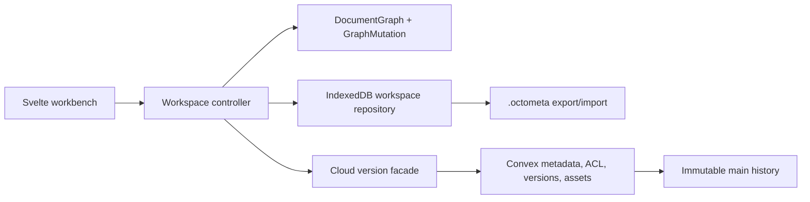
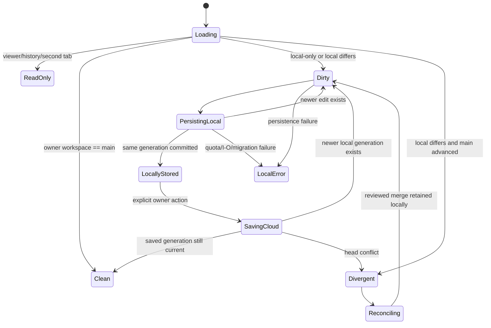

# feat: Browser-First, Versioned Document Persistence

## Overview

Replace OctoMeta's 500 ms full-document cloud rewrite with three explicit durability layers:

1. An automatically persisted, account-scoped browser workspace in IndexedDB.
2. A self-contained `.octometa` file that the owner deliberately exports and can import after browser data loss.
3. Immutable Convex main versions created only when the owner explicitly saves or reconciles.

The owner edits a device-local main working copy or a named device-local branch. Undo/redo remains local. A cloud save captures the whole authored document, excludes undo/UI state, creates `main vN+1`, and advances the head atomically. The owner may restore history only by creating another version. Viewers are online and read-only in this release.

This plan preserves the existing product architecture: `DocumentGraph` remains the in-memory source of truth, every authored change still enters through `GraphMutation`, Univer remains behind its adapter, and UI code continues to reach storage/backends only through `$lib/persistence`.

## Enhancement Summary

Deepening the agreed brainstorm added the execution detail needed to implement and roll out the change safely:

- A separately deployable incident phase fixes **both** non-progress cleanup loops: expired-document purge and reachable-asset cleanup.
- Local workspaces retain a hash-addressed **base snapshot**, not only a version number/hash, so three-way reconciliation has an actual base and device-local branches remain recoverable.
- Cloud saves use a persisted client `operationId` in addition to head compare-and-swap, making retries idempotent when a mutation commits but its response is lost.
- Durable integrity uses SHA-256; the engine's documented non-cryptographic `fastHash` remains limited to recalculation memoization.
- Reconciliation compares an authored-state projection, excluding computed graph values/hashes and graph-projected workbook values that would otherwise produce false conflicts.
- Version-to-asset references and staged uploads make immutable-history reachability indexed and failed uploads cleanable without scanning every block or undo entry.
- The shared-device policy is resolved: explicit sign-out requires save/export/discard of unfinished work, then deletes that account's entire browser namespace before ending the session.
- Viewer behavior is resolved: online/read-only, account-scoped list metadata only in IndexedDB, no locally persisted authored bundle/assets, no export/duplicate/branch/offline access, and authorized asset bytes rather than reusable Convex bearer URLs.
- Migration is additive, resumable, per-document, and canaried. A converted document can no longer accept the legacy mutable save path; legacy rows remain read-only through the observation window.
- Performance budgets, hostile-archive limits, local generation fencing, service-worker update behavior, deployment gates, and a complete browser/Convex/unit test matrix are specified below.

## Current-State Evidence

The redesign is required by concrete behavior in the current branch:

- `src/lib/persistence/saver.ts:36-118` coalesces edits for only 500 ms before persisting.
- `src/lib/persistence/client.ts:113-129` serializes and sends the entire graph, workbook manifest, workbook snapshot, and undo stack.
- `src/convex/documents.ts:256-327` validates, deletes, and recreates all normalized document rows in one mutation.
- `src/routes/app/[docId]/+page.svelte:146-185,329-376,564-572` sends graph edits, undo/redo, parameters, editor changes, and workbook changes through that same cloud saver.
- `src/convex/documents.ts:231-247` ranges over optional `deletedAt`, includes live rows because Convex orders `undefined` before numbers, and immediately reschedules on raw page length.
- `src/convex/files.ts:117-154` can also reschedule without progress when a full page contains reachable old assets.
- `src/lib/persistence/client.ts:16-17` exposes a Convex table ID as the product's document identity.
- `src/lib/engine/types.ts:216-234` explicitly says `fastHash` is never for security.
- `src/routes/app/+layout.server.ts:4-9` and `src/routes/app/+layout.svelte:22-31` assume a live server-auth check, so a service worker alone cannot make an owner workspace reopen offline.
- `src/lib/engine/block.ts`, `src/lib/editor/image-node.ts`, and `src/routes/app/[docId]/+page.svelte:188-213` embed and upload Convex `storageId` values before an image block can exist.

Relevant repository history is concentrated in `27637eb` (initial full-cloud persistence) and `01de762` (R1.6 ownership, workbook atomicity, trash/assets, and production wiring). There is no IndexedDB, portable-file, ACL, immutable-version, service-worker, or reconciliation implementation to preserve.

The only institutional learning under `docs/solutions/` is the workbook-tab reactivity fix. Apply its rule here: keep engine objects framework-neutral, use stable IDs, and refresh Svelte presentation models with fresh identities at explicit local-store/cloud-settle boundaries.

## Goals

- Persist every accepted owner edit automatically to a browser working copy without a Convex product call.
- Let an owner create a new immutable main version only by an explicit action.
- Preserve local undo/redo across reloads while structurally excluding it from cloud versions and portable files.
- Support local-only documents, owner main working copies, named local branches, divergence detection, conservative reconciliation, history, restore-as-new-version, and independent duplication.
- Work offline for previously opened owner workspaces and newly created local-only documents.
- Give the owner a portable, validated recovery artifact containing authored content and referenced assets.
- Make document-list and workbench UI state explicit: access right, workspace/branch, current main version, base version, and local/cloud durability.
- Keep shared users online and read-only; enforce authorization on metadata, versions, history, and assets.
- Migrate existing documents without data loss, legacy overwrite, history rewind, or an all-at-once destructive cutover.
- Bound cloud work, local memory, archive parsing, cleanup, and migration operations.

## Non-Goals

- Block-, cell-, or operation-level cloud sync.
- Realtime collaboration, presence, comments, or collaborative undo.
- Cloud backup of unfinished branches.
- Viewer offline caching, viewer export, or viewer duplication.
- OPFS, geometry binaries, or a second local persistence substrate.
- ProseMirror OT, cell-level workbook merge, or automatic merging of two opaque workbook presentations.
- Replaying undo entries as cloud history.
- Rewinding or deleting individual main versions.
- Silent background cloud sync, even when connectivity returns.
- Browser-side encryption or offline key recovery in this release.
- Importing an `.octometa` file directly back into an existing cloud lineage; import starts an independent local document.

## Resolved Product and Technical Decisions

| Decision | Chosen behavior |
|---|---|
| Local database | IndexedDB via pinned `idb@8.0.3`; keep native IndexedDB concepts visible behind a repository adapter. |
| Local database tests | Pin `fake-indexeddb@6.2.5` for fast transaction/migration tests; retain real-browser coverage. |
| Portable archive | Pin `fflate@0.8.3`; stream archive members and enforce bounds while inflating. |
| Domain IDs | App-generated 26-character ULIDs for documents, cloud versions, workspaces/branches, assets, and operation IDs. Convex `_id` stays inside the cloud adapter. |
| Title | Authored/versioned content. `documents.title` is the head title denormalized for lists. A local rename is dirty until Save new version. |
| Local autosave | 500 ms trailing coalescence with a 2 s maximum dirty interval, one captured/in-flight generation, and generation-aware follow-up writes. |
| Local commit | Workspace content and undo state commit atomically; asset insertion and the first generation referencing it use one multi-store transaction. |
| Local durability label | Show “Stored on this device” only after transaction completion. `pagehide` flush is best effort and never the evidence for that label. |
| Cross-tab | Web Locks exclusive lease plus BroadcastChannel notifications. Use cooperative takeover; never silently `steal`. Unsupported Web Locks means read-only with a supported-browser message. IndexedDB expected-generation CAS is the final stale-writer fence. |
| Persistent origin storage | Ask contextually after the first meaningful committed owner generation. A `false` result is guidance to export, not a fatal error. |
| Shared device | On explicit sign-out, require save/export/discard/cancel for unfinished work, then release leases/object URLs and delete the entire account namespace before Better Auth sign-out. |
| Owner offline auth | A previously authenticated local profile may reopen its own local workspace offline. This is device trust, not cloud authorization; all cloud controls stay locked until the same subject reauthenticates. |
| Viewer | Online/read-only. Account-scoped list metadata may be cached for reconciliation but is never rendered offline and is deleted on sign-out; authored bundles/assets stay in memory only. No undo, branch, save, restore, trash, export, duplicate, or offline reload. |
| Integrity | SHA-256 lowercase hex for bundle, chunk, asset, operation-input, and archive-member integrity. Keep `fastHash` only for engine content recalculation. |
| Cloud bundle chunks | Server canonicalizes and splits at a 700 KiB target, yielding at most six rows under the existing 4 MiB bundle cap and Convex's 1 MiB document limit. |
| Version retention | Retain every main version in R1. Never prune silently. Track count/bytes and fail clearly at configured limits rather than changing history. |
| Initial history limits | Maximum 200 versions and 256 MiB authored snapshot bytes per document; both are server constants and shown in usage UI. Assets are counted separately. |
| Assets | Stable local `assetId` in authored content. New blobs are local first; upload/finalize only for explicit cloud operations. Each cloud version gets indexed asset references. |
| Asset delivery | Authenticated Convex action returning bytes (10 MiB current file cap is below the 16 MiB action return limit), converted to a Blob/object URL client-side. Do not expose reusable `storage.getUrl()` URLs to viewers. |
| Portable import | Validate completely, then create a new local-only document ID with fresh undo. Source IDs/branch/version are untrusted provenance only. |
| Branch names | Trimmed 1–80 characters, unique per local document case-insensitively. |
| `Cmd/Ctrl+S` | Dirty owner main: Save new version. Branch/divergent main: open reconciliation review. Offline: confirm the work is local and explain cloud save is unavailable. Clean main: announce current version. |
| Reconciliation | Three-way authored-state comparison. Auto-merge only proven non-overlapping entities; same-entity, delete/modify, both-side block order, both-side prose, and both-side workbook presentation changes require an explicit Main/Branch choice. |
| No-change save | Return `unchanged` without creating a version. |
| Sharing | Viewer ACL/read paths are part of this plan. Owner-facing sharing ships only with verified-email invitation acceptance; the client never submits an authoritative principal ID. |
| Production rollout flag | Server-derived capability based on authenticated subject plus document `persistenceMode`; never trust a public client flag. A public flag is allowed only in local/preview builds. |

## Target Architecture



### Module Boundaries

Keep the public `$lib/persistence` boundary, but split responsibilities internally:

```text
src/lib/persistence/
  model.ts                 branded IDs, limits, Local/Cloud/Portable contracts
  serialize.ts             engine ⇄ local/authored bundles
  canonical.ts             deterministic canonical bytes only
  integrity.ts             SHA-256 helpers and known-vector tests
  workspace.ts             framework-neutral workspace controller/state machine
  local/
    db.ts                  IndexedDB open/schema/versionchange handling
    migrations.ts          forward-only record migrations
    repository.ts          generations, base snapshots, summaries, local CAS
    saver.ts               coalescing and one-in-flight generation writer
    locks.ts               Web Locks/BroadcastChannel coordination
    assets.ts              blob validation, object URLs, reachability, quota
    account.ts             local profile and sign-out cleanup
  cloud/
    client.ts              Convex-only typed facade
    versions.ts            head/history/save/restore operations
    assets.ts              stage/upload/load/finalize operations
    access.ts              owner/viewer summaries and invitations
  portable/
    archive.ts             streamed writer/reader
    validate.ts            fail-closed manifest/member validation
  reconcile/
    projection.ts          authored comparison projection
    diff.ts                base/main/workspace change sets
    merge.ts               conservative merge and conflict result
```

Split Convex product functions along the same seams:

```text
src/convex/
  productAuth.ts           identity plus owner/viewer authorization helpers
  documents.ts             summary/list/trash/restore lifecycle
  documentVersions.ts      immutable load/save/restore
  documentAccess.ts        grants and invitation acceptance/revocation
  files.ts                 staged assets and authenticated byte loading
  migrations.ts            resumable legacy conversion
  maintenance.ts           reset, durable purge, verification counters
  crons.ts
  schema.ts
```

`src/routes/app/[docId]/+page.svelte` is already a large orchestration surface. Move storage/version/reconcile state into the framework-neutral workspace controller; keep the route responsible for mounting TipTap/Univer, rendering states, and passing callbacks.

## Domain Contracts

### Stable IDs and Bundles

Define branded string types in `src/lib/persistence/model.ts`; do not reuse Convex `Id` types outside `src/lib/persistence/cloud/`:

```ts
type DocumentId = string & { readonly __documentId: unique symbol };
type VersionId = string & { readonly __versionId: unique symbol };
type WorkspaceId = 'main' | (string & { readonly __workspaceId: unique symbol });
type AssetId = string & { readonly __assetId: unique symbol };
type OperationId = string & { readonly __operationId: unique symbol };
type Sha256 = string & { readonly __sha256: unique symbol };
type VersionRef = { versionId: VersionId; versionNumber: number; hash: Sha256 };

type AuthoredDocumentBundle = {
  schemaVersion: 1;
  documentId: DocumentId;
  title: string;
  graph: AuthoredGraphPayload;       // no undoLog/undoCursor
  workbookManifest: WorkbookManifest;
  workbookSnapshot: unknown;
  assets: AssetManifestEntry[];
};

type LocalDocumentBundle = {
  authored: AuthoredDocumentBundle;
  undo: PersistedWorkspaceHistory;
};

type PersistedWorkspaceHistory = {
  epochs: Array<{
    epochId: string;
    entries: PersistedUndoEntry[];       // GraphMutation entries for this epoch
    cursor: number;
  }>;
  boundaries: Array<{
    beforeEpochId: string;
    afterEpochId: string;
    beforeSnapshotHash: Sha256;
    afterSnapshotHash: Sha256;
    beforeBase: VersionRef | null;
    afterBase: VersionRef | null;
  }>;
  activeEpochId: string;
};
```

Required structural guarantees:

- `serializeAuthoredDocument` has no undo parameter and its return type has no undo fields.
- `serializeLocalDocument` adds the undo contract explicitly.
- `hydrateAuthoredDocument` always starts with an empty undo stack.
- `hydrateLocalDocument` restores the active graph-mutation epoch and validates every epoch, cursor, boundary, checkpoint, and base reference.
- Title, graph authored fields, workbook manifest/snapshot, and referenced asset manifest all contribute to the authored bundle SHA-256.
- `schemaVersion` belongs to authored content; IndexedDB database version and `.octometa` format version remain separate.
- Existing `toConvexJson`/`fromConvexJson` remains a backend impedance codec. The portable format uses its own versioned JSON contract and does not expose `THETA` rewriting as a file-format rule.

### Hashes and Dirty State

Track three distinct values:

- `baseMainHash`: the cloud version the workspace is based on.
- `authoredHash`: SHA-256 of current authored content, excluding undo; compare this with the cloud head.
- `localGenerationHash`: SHA-256 of authored content plus local undo; verify browser recovery.

An undo-only metadata change can alter `localGenerationHash` without changing `authoredHash`. Saving a cloud version updates the base hash/version but never clears local undo.

### Workspace State

```ts
type LocalWorkspace = {
  accountId: string;
  documentId: DocumentId;
  workspaceId: WorkspaceId;
  kind: 'main' | 'branch';
  branchName?: string;
  generation: number;
  bundle: LocalDocumentBundle;
  authoredHash: Sha256;
  localGenerationHash: Sha256;
  baseMainVersionId?: VersionId;
  baseMainVersionNumber?: number;
  baseMainHash?: Sha256;
  baseSnapshotHash?: Sha256;
  pendingOperationId?: OperationId;
  createdAt: number;
  updatedAt: number;
  persistedAt: number;
};
```

`baseSnapshotHash` references an immutable local snapshot containing the complete authored base. Every main working copy and branch keeps that snapshot until it rebases or is discarded. This removes dependence on network availability or future retention behavior during diff construction.

`pendingOperationId` references an immutable `pendingOperations` record rather than describing the upload inline. That record owns the exact generation being saved, so generation `G+1` may replace the live workspace while generation `G` remains retryable after a response loss or browser restart.

### UI State Machine



Do not overload one `SaveState`. Render two independent facts:

- Local: `Saving to device…`, `Stored on this device`, or `Device save failed`.
- Cloud: `Main vN`, `Changes not saved to cloud`, `Saving new version…`, `Reconciliation required`, or `View only`.

## Browser Workspace Design

### IndexedDB Schema v1

Use database name `octometa-workspaces` and the following stores:

| Store | Key | Indexes | Purpose |
|---|---|---|---|
| `profiles` | `accountId` | `by-last-seen` | Last authenticated local account marker, storage-prompt state, and durable `active`/`deleting` cleanup state. |
| `cloudDocuments` | `[accountId, documentId]` | `by-account-updated`, `by-account-role` | Last-known metadata/role/head summary. Never authoritative for viewer offline access. |
| `workspaces` | `[accountId, documentId, workspaceId]` | `by-account-updated`, `by-document` | Current local main/branch generation and undo. |
| `baseSnapshots` | `[accountId, documentId, snapshotHash]` | `by-document` | Deduplicated immutable authored bases and undo-transition checkpoints. |
| `assets` | `[accountId, documentId, assetId]` | `by-document`, `by-document-content-hash` | Local blobs, hashes, MIME, size, and optional cloud mapping. Content-hash lookup is scoped to the account and document. |
| `pendingOperations` | `[accountId, operationId]` | `by-workspace`, `by-created` | Immutable exact cloud-save inputs and generation payload retained until acknowledgement is committed locally. |

Each `pendingOperations` value contains `accountId`, `documentId`, `workspaceId`, `operationId`, generation, canonical authored-bundle bytes, bundle/authored hash, operation-input hash, expected head public version ID/number/hash, source/message/provenance/branch-base fields, asset manifest, and creation time. Do not create a persistent lease store: Web Locks provides the live lease and IndexedDB generation CAS provides the durable fencing rule.

Open/upgrade requirements:

- Handle `versionchange` by notifying the UI and closing the connection.
- If an upgrade is blocked, show “Close OctoMeta in other tabs to finish updating”; never delete/recreate draft stores.
- Keep upgrade functions synchronous with respect to the IndexedDB transaction; do not await unrelated promises that let the transaction go inactive.
- Request `readwrite` with `{ durability: 'strict' }` where supported and fall back to browser default without reporting failure.
- Keep database migrations forward-only and fixture-tested. The initial release has one schema version, but the migration registry and blocked-upgrade behavior ship now.

### Automatic Local Save Algorithm

Replace `createDocumentSaver` with `createLocalWorkspaceSaver`:

1. Every accepted graph/editor/workbook/title mutation increments an in-memory revision and calls `markDirty()`.
2. Start a 500 ms trailing timer and a non-resetting 2 s maximum timer.
3. When either fires, synchronously flush prose and workbook projections, structured-clone one coherent graph/workbook generation, and record its generation number.
4. Canonicalize/hash the clone asynchronously. Do not read the live graph during hashing.
5. In one IndexedDB transaction, read the current durable generation, require it to equal `expectedGeneration`, verify every content-referenced asset exists, then write the new workspace generation.
6. Wait for transaction completion before emitting `stored`.
7. If newer edits arrived during capture/write, keep the UI dirty and immediately capture the newest state; do not queue every intermediate serialization.
8. On quota or I/O failure, retain the previous durable generation, keep current memory dirty, show the exact failure, and offer Export now/Remove unused local copies.

Add `beforeunload` only while an accepted edit has not completed its local transaction. `visibilitychange`/`pagehide` may request a flush but are not relied on for correctness.

### Consistent Editor/Workbook Capture

The workspace controller owns one `captureGeneration()` callback supplied by the route:

- `docEditor.flushProse()` completes first.
- Add and document `workbookAdapter.flushPendingEdits()`. It drains the current `queueMicrotask`-backed cell/defined-name projection queue and resolves only when all events accepted before the call are reflected in the graph.
- `workbookAdapter.saveSnapshot()` and `serializeLocalDocument(graph, snapshot, title)` are called in the same JavaScript task after those flushes.
- The resulting plain data is cloned before yielding.
- Re-entrant `onChanged`/`ondirty` events raised by flushing mark the next revision but do not create overlapping captures.

Tests must cover queued cell and defined-name events plus a prose edit arriving during hash/write, proving the capture barrier makes the first generation coherent and the second is persisted afterward.

The existing `DocumentGraph.undo()/redo()` remains synchronous and owns only `GraphMutation` entries inside the active epoch. Add an async workspace-history controller above it; route/editor undo and redo callbacks call that controller. It delegates within an epoch, but at an epoch edge it loads and verifies the referenced checkpoint from IndexedDB, atomically replaces graph/workbook/base state, hydrates the adjacent epoch into `DocumentGraph`, and advances the boundary cursor only after the swap commits locally. While a boundary loads, disable further mutations/undo; on read/hash/hydration failure leave graph and cursor unchanged. This avoids teaching `GraphMutation` how to resolve IndexedDB hashes and makes epoch-aware pruning an explicit workspace responsibility.

### Multi-Tab Coordination

- Lock name: `octometa:<accountId>:<documentId>:<workspaceId>`.
- Request with `ifAvailable: true`. A tab that cannot acquire opens read-only and identifies the editing tab as “another tab on this device.”
- Broadcast `generation-stored`, `head-advanced`, `takeover-request`, `takeover-ready`, and `workspace-deleted` messages.
- Takeover is cooperative: current owner flushes, acknowledges the persisted generation, releases the lock, and only then may the requester acquire it. If flush fails because of quota/I/O, broadcast `takeover-denied`, retain the lock, keep the requester read-only, and offer no force path.
- Never use `steal` for routine takeover.
- After acquiring, reread the durable generation. Every write also checks expected generation, so a stale tab cannot overwrite even if coordination fails.
- If Web Locks is unavailable, allow read-only access and explain the browser requirement. Do not invent a weaker concurrent-edit mode in R1.

### Quota and Asset Rules

Keep the current 10 MiB per-image cap and restrict R1 to PNG, JPEG, GIF, and WebP after magic-byte validation. Reject SVG/HTML.

Additional limits:

- At most 100 referenced assets per authored document.
- At most 100 MiB aggregate referenced asset bytes per document.
- Authored JSON bundle at most 4 MiB; workbook snapshot at most 750 KiB.
- Local undo at most 200 entries and 8 MiB encoded. Transition checkpoints have a separate 64 MiB per-document cap. Prune the oldest complete undo epochs plus their unreferenced checkpoints and adjust the cursor when a cap is reached; always retain the active reconciliation base and current boundary.

Before accepting a new blob, call `navigator.storage.estimate()` and require enough estimated room for the blob plus the next bundle write and a reserve of `max(50 MiB, 10% of quota)`. Estimates are advisory; still handle `QuotaExceededError` transactionally.

Image insertion is a staged controller operation because the current graph mutation API is synchronous:

1. Validate bytes/type/size and hash with SHA-256.
2. Create a stable `assetId` and object URL.
3. Build the candidate graph/block without publishing it to the mounted editor, then call one repository method accepting the new asset record plus the complete candidate workspace generation.
4. Commit the blob and first referencing generation in one multi-store transaction; only after completion swap/render the candidate graph. On abort, revoke the candidate URL and leave the prior graph/generation unchanged.
5. Revoke object URLs on block replacement, workspace close, account cleanup, and sign-out.

Conservatively retain local assets referenced by current content or undo. A first release may retain all assets until every workspace for the document is removed; do not risk deleting undo-reachable bytes for an eager GC optimization.

### Account and Sign-Out Policy

`UserBadge.svelte` must call an account-cleanup coordinator before `authClient.signOut()`:

1. Enumerate local-only, dirty, divergent, and branch workspaces for the authenticated account.
2. If none exist, confirm and delete the namespace.
3. Otherwise present each unfinished workspace and allow: Publish/Save for a non-divergent main, Reconcile for a branch/divergent main (online owner only), Export, Discard local work, or Cancel sign-out.
4. Offline mode offers Export, Discard, or Cancel.
5. Before the first bounded deletion, mark the profile namespace `deleting`. After resolution, release locks, close DB handles, revoke object URLs, cancel/clear any invitation handoff cookie, and delete cached summaries, workspaces, base snapshots, pending operations, assets, and finally the profile in resumable bounded transactions.
6. Then call Better Auth sign-out and navigate to `/signin`.

Verify the namespace is empty before Better Auth sign-out. If deletion fails, retain/resume the `deleting` marker and keep sign-out/account entry blocked. A different authenticated subject may never list, inspect, or export the prior subject's titles or documents; the only choices are reauthenticate as the prior subject or perform a blind confirmed deletion. Session expiry is different from explicit sign-out: keep persisting the already-bound local workspace, disable cloud operations, and require reauthentication as the same subject.

## Portable `.octometa` Contract

### Format v1

```text
manifest.json
document.json
workbook.json
assets/<assetId>.<validated-extension>
```

`manifest.json` contains:

- `format: "octometa"` and `formatVersion: 1`.
- Authored `schemaVersion` and supported app compatibility range.
- Exported generation and timestamp.
- Untrusted provenance: source document ID, source main version/hash, workspace kind, and branch name.
- One member record for every archive member except `manifest.json`, with exact path, byte length, SHA-256, MIME, and asset ID where applicable. The manifest is excluded to avoid an impossible self-hash.
- Overall authored-bundle SHA-256.

Export captures one committed generation. Later edits do not change the file being produced and remain locally dirty. Undo, cursor, selections, inspector/drawer state, access rights, cloud invitation data, bearer URLs, and local cloud-operation state are excluded.

### Export Behavior

- Flush and locally commit generation `G` before packaging.
- Ensure all content-referenced asset blobs are local. If a cloud asset is missing locally, fetch it through the authenticated asset action; offline export fails with the exact missing asset list.
- Use `showSaveFilePicker()` when available and initiated by a user gesture. Retain the Blob download fallback on every browser.
- If an existing file handle loses permission, ask again or fall back to download; never report an export until the stream closes successfully.
- Store the last file handle only if the browser allows it and only inside the account namespace.

### Hostile Import Validation

Validate the complete archive before creating IndexedDB records:

- Maximum 104 entries: three required JSON files plus at most 100 assets and one future reserved member.
- Maximum 105 MiB compressed archive input, 4 MiB total uncompressed JSON, 750 KiB workbook JSON, 10 MiB each asset, and 104 MiB total uncompressed archive content. Enforce a maximum 100:1 cumulative inflation ratio while streaming in addition to absolute limits.
- Reject absolute paths, `..`, backslashes, NULs, duplicate names, duplicate asset IDs, unknown required members, encrypted archives, unsupported compression, and members not declared in the manifest.
- Track inflated bytes while streaming; stop immediately at any bound rather than inflating first.
- Verify every declared member's size and SHA-256 before parsing/accepting it; verify `manifest.json` against the exact manifest schema but not against the member table.
- Add one shared browser/Convex-safe runtime validation module and use it for archive and cloud arguments. It enforces the documented title/tab/node/block/chip/count/string limits, maximum JSON nesting depth 64, exact ProseMirror node/mark/attribute shapes, `https:`/`mailto:` URL allowlists where URLs are permitted, workbook/manifest/graph agreement, and asset MIME plus magic bytes; current TypeScript types and `unknown`/`v.any()` fields are not validators.
- Recalculate the complete graph and fail on integrity/reproducibility errors.
- Import all validated content/assets as one new local-only document/workspace with a fresh document ID and empty undo history.
- On any failure, commit nothing and show a member/path-specific error without echoing unsafe content into HTML.

If the imported title collides, append a deterministic local display suffix such as “(imported)” without changing provenance. Automatic attachment to the source lineage is deferred.

## Cloud Data Model

### Additive Compatibility Schema

The first schema deployment must remain compatible with existing rows and the existing browser build. Add target fields/tables without removing existing validators or indexes. The shapes below are the post-backfill target; in the first compatibility validator, every newly added field on the existing `documents` and `assets` tables is optional, and absent `persistenceMode` means `legacy`. Retain the legacy asset `docId` field and `by_doc` index throughout compatibility; populate both legacy and new relations during transition, switch every reader, backfill/verify, and tighten/remove legacy fields only in a later cleanup deployment. Head fields remain optional permanently for atomic v1 creation.

Expose a small authenticated `getPersistenceCapabilities` query. In production it reads a server-only global kill switch plus owner canary cohort; explicit migration-job selection controls document conversion. The browser cannot self-enroll. Cache a granted owner capability locally only to permit that same subject's offline local workspace behavior. The row's `persistenceMode` is always authoritative: every compatibility client routes a versioned row through version reads/local workspaces even if exposure flags are off, while flags control only conversion eligibility and browser-first exposure for legacy/local-only documents. Every cloud function still checks document mode/role independently.

Target shapes (Convex `_id` fields omitted):

```ts
documents: {
  documentId: string;                   // public stable ULID
  ownerId: string;
  title: string;                        // denormalized current-head title
  status: 'live' | 'trashed' | 'purging';
  persistenceMode: 'legacy' | 'versioned';
  migrationState?: 'none' | 'draining' | 'converted';
  mainVersionId?: Id<'documentVersions'>; // optional permanently so v1 can be inserted atomically
  mainVersionNumber?: number;
  mainHash?: string;
  versionCount: number;
  versionBytes: number;
  retainedAssetCount: number;
  retainedAssetBytes: number;
  recoveryCaptureCount: number;
  recoveryCaptureBytes: number;
  stats: DocumentStats;
  createdAt: number;
  updatedAt: number;
  deletedAt?: number;
};

documentVersions: {
  versionId: string;                    // public stable VersionId ULID
  documentRowId: Id<'documents'>;       // internal relation
  state: 'staging' | 'active';
  migrationJobId?: Id<'documentMigrationJobs'>;
  versionNumber: number;
  parentVersionId?: Id<'documentVersions'>;
  source: 'migration' | 'main-save' | 'branch-reconcile' | 'restore' | 'duplicate';
  sourceVersionId?: Id<'documentVersions'>;
  sourceDocumentId?: string;
  branchBaseVersionId?: Id<'documentVersions'>;
  branchBaseHash?: string;
  operationId: string;
  operationInputHash: string;
  createdBy: string;
  message?: string;
  schemaVersion: number;
  bundleHash: string;
  byteLength: number;
  chunkCount: number;
  stats: DocumentStats;
  createdAt: number;
};

snapshotChunks: {
  versionId: Id<'documentVersions'>;
  index: number;
  bytes: ArrayBuffer;
  byteLength: number;
  chunkHash: string;
};

assets: {
  docId?: Id<'documents'>;              // legacy compatibility field; remove later
  documentRowId?: Id<'documents'>;      // absent only while a v1 publish is staged
  publicDocumentId: string;
  assetId: string;
  storageId: Id<'_storage'>;
  ownerId: string;
  contentHash: string;
  contentType: string;
  size: number;
  state: 'staged' | 'available' | 'pendingDeletion';
  uploadOperationId?: string;
  stagedAt?: number;
  nextAttemptAt?: number;
  lastReachabilityCheckedAt?: number;
  deleteAttempts: number;
  lastError?: string;
  createdAt: number;
};

versionAssets: {
  documentRowId: Id<'documents'>;
  versionId: Id<'documentVersions'>;
  assetId: string;
  createdAt: number;
};

documentAccess: {
  documentRowId: Id<'documents'>;
  principalId: string;
  role: 'viewer';
  grantedBy: string;
  invitationId?: Id<'documentInvitations'>;
  createdAt: number;
};

documentInvitations: {
  documentRowId: Id<'documents'>;
  emailNormalized: string;
  tokenHash: string;
  role: 'viewer';
  status: 'pending' | 'accepted' | 'revoked';
  deliveryStatus: 'pending' | 'sent' | 'failed';
  sendAttempts: number;
  lastSentAt?: number;
  lastDeliveryError?: string;
  invitedBy: string;
  acceptedBy?: string;
  expiresAt: number;
  createdAt: number;
  updatedAt: number;
};

invitationHandoffs: {
  invitationId: Id<'documentInvitations'>;
  handoffHash: string;
  invitationTokenHash: string;
  status: 'pending' | 'used' | 'cancelled';
  expiresAt: number;
  createdAt: number;
  usedAt?: number;
};

documentMigrationJobs: {
  documentRowId: Id<'documents'>;
  operationId: string;
  mode: 'dry-run' | 'convert';
  status: 'pending' | 'running' | 'failed' | 'verified' | 'activated';
  cursor?: string;
  sourceRevision?: number;
  sourceHash?: string;
  drainStartedAt?: number;
  lastLegacyWriteAt?: number;
  lastCompatibilityAckAt?: number;
  rowsProcessed: number;
  bytesProcessed: number;
  leaseUntil?: number;
  attempts: number;
  lastError?: string;
  startedAt?: number;
  updatedAt: number;
};

documentPurgeJobs: {
  documentRowId: Id<'documents'>;
  stage: 'recovery' | 'references' | 'chunks' | 'versions' | 'access' | 'assets' | 'verify';
  cursor?: string;
  leaseUntil?: number;
  attempts: number;
  lastError?: string;
  startedAt: number;
  updatedAt: number;
};

accountStorageUsage: {
  ownerId: string;
  retainedAssetCount: number;
  retainedAssetBytes: number;
  updatedAt: number;
};

legacyRecoveryCaptures: {
  captureId: string;
  documentRowId: Id<'documents'>;
  source: 'legacy-save' | 'legacy-rename';
  authoredHash: string;
  sourceLegacyRevision?: number;
  state: 'ready' | 'imported' | 'discarded';
  byteLength: number;
  chunkCount: number;
  expiresAt?: number;                   // set only after import/discard resolution
  createdAt: number;
  resolvedAt?: number;
};

legacyRecoveryChunks: {
  captureId: Id<'legacyRecoveryCaptures'>;
  index: number;
  bytes: ArrayBuffer;
  byteLength: number;
  chunkHash: string;
};

legacyRecoveryAssets: {
  captureId: Id<'legacyRecoveryCaptures'>;
  storageId: Id<'_storage'>;
  assetId?: string;
  createdAt: number;
};
```

Required indexes:

| Table | Index | Fields |
|---|---|---|
| `documents` | `by_document_id` | `documentId` |
| `documents` | `by_owner_status_updated` | `ownerId, status, updatedAt` |
| `documents` | `by_status_deleted_at` | `status, deletedAt` |
| `documentVersions` | `by_version_id` | `versionId` |
| `documentVersions` | `by_document_state_number` | `documentRowId, state, versionNumber` |
| `documentVersions` | `by_document_operation` | `documentRowId, operationId` |
| `documentVersions` | `by_migration_job_state` | `migrationJobId, state` |
| `snapshotChunks` | `by_version_index` | `versionId, index` |
| `assets` | `by_doc` | `docId` (legacy compatibility) |
| `assets` | `by_document_asset` | `documentRowId, assetId` |
| `assets` | `by_document_state_asset` | `documentRowId, state, assetId` |
| `assets` | `by_public_document_operation_asset` | `ownerId, publicDocumentId, uploadOperationId, assetId` |
| `assets` | `by_document_operation_asset` | `documentRowId, uploadOperationId, assetId` |
| `assets` | `by_owner_state` | `ownerId, state` |
| `assets` | `by_storage` | `storageId` |
| `assets` | `by_state_next` | `state, nextAttemptAt` |
| `assets` | `by_state_reachability_check` | `state, lastReachabilityCheckedAt` |
| `versionAssets` | `by_version` | `versionId` |
| `versionAssets` | `by_version_asset` | `versionId, assetId` |
| `versionAssets` | `by_document_asset` | `documentRowId, assetId` |
| `documentAccess` | `by_document_principal` | `documentRowId, principalId` |
| `documentAccess` | `by_principal` | `principalId` |
| `documentInvitations` | `by_document_email` | `documentRowId, emailNormalized` |
| `documentInvitations` | `by_token_hash` | `tokenHash` |
| `documentInvitations` | `by_status_expiry` | `status, expiresAt` |
| `invitationHandoffs` | `by_handoff_hash` | `handoffHash` |
| `invitationHandoffs` | `by_invitation_status` | `invitationId, status` |
| `invitationHandoffs` | `by_status_expiry` | `status, expiresAt` |
| `documentMigrationJobs` | `by_document_operation` | `documentRowId, operationId` |
| `documentMigrationJobs` | `by_status_updated` | `status, updatedAt` |
| `documentPurgeJobs` | `by_document` | `documentRowId` |
| `documentPurgeJobs` | `by_stage_updated` | `stage, updatedAt` |
| `accountStorageUsage` | `by_owner` | `ownerId` |
| `legacyRecoveryCaptures` | `by_capture_id` | `captureId` |
| `legacyRecoveryCaptures` | `by_document_hash` | `documentRowId, authoredHash` |
| `legacyRecoveryCaptures` | `by_document_state_created` | `documentRowId, state, createdAt` |
| `legacyRecoveryCaptures` | `by_state_expiry` | `state, expiresAt` |
| `legacyRecoveryChunks` | `by_capture_index` | `captureId, index` |
| `legacyRecoveryAssets` | `by_capture` | `captureId` |
| `legacyRecoveryAssets` | `by_storage` | `storageId` |

Convex does not provide foreign keys or declarative unique constraints. Mutation code and tests enforce uniqueness by indexed `.unique()` reads inside serializable transactions.

### Cloud Invariants

- One and only one document row has a given public `documentId`.
- `status === 'live'` has no `deletedAt`; `trashed` and `purging` require one.
- A legacy row may omit all head fields. Every externally visible `persistenceMode === 'versioned' && status === 'live'` row has all three head fields, which describe the same complete `state === 'active'` version belonging to the same document. Validators keep them optional permanently because publish must insert the header before it knows the Convex version `_id`; one Convex transaction inserts the headless header, active v1/chunks/references, then patches all head fields, so no observer sees the intermediate row.
- Head version numbers begin at 1 and advance by exactly one.
- A new version's `parentVersionId` is the head checked in that mutation. Restore never makes the restored source the parent.
- Public `versionId` is unique; `(documentRowId, state, versionNumber)` and `(documentRowId, operationId)` are unique.
- Cloud adapters translate internal parent/source/head IDs to public stable `VersionId` values before returning domain contracts; no Convex `_id` is written to IndexedDB, portable files, routes, or UI state.
- A repeated operation ID for a version-creating operation with the same `operationInputHash` returns the original result; the same ID with different inputs fails closed. A no-change result creates no receipt: retry re-evaluates against the current head and returns `unchanged` when hashes still match, or the normal fast-forward/conflict result if the head moved.
- Snapshot chunks are contiguous `0..chunkCount-1`, each verifies its SHA-256, and concatenation verifies `byteLength` and `bundleHash`.
- A cloud bundle cannot encode undo entries, undo cursor, selection, or local workspace state.
- A staged asset may be temporarily keyed by owner/public document/operation before v1 exists. Every `available` asset has an internal `documentRowId` relation.
- Within a document, one `assetId` is immutably bound to one `(contentHash, contentType, size)` tuple. Reusing it with different bytes/metadata fails closed. Every asset referenced by a retained version is `available`, belongs to that document, matches the immutable tuple, and has exactly one `(versionId, assetId)` reference.
- Document/account retained-asset counters equal unique storage bytes still in `available` or `pendingDeletion` state. Promotion increments them only for a newly available unique asset; successful storage deletion decrements them. Version references do not double-count reused assets.
- History/head/load queries return only active versions. Migration staging versions are invisible and can be deleted only by their migration job while they are non-head.
- Legacy recovery captures are a migration-only quarantine, never main/history and never viewer-readable. They contain authored state with undo removed, are hash/chunk verified, protect referenced assets, and are bounded to 50 captures/256 MiB per document. A legacy endpoint returns its old success shape only after the capture commits; at the cap it fails rather than acknowledging uncaptured work.
- No cleanup path deletes an asset referenced by any retained version.
- A no-change save creates no version.
- Viewer authorization is independently applied to document summary, head, history, version chunks, and asset bytes. Viewer write functions do not exist.
- Externally, unauthorized and missing return the same not-found state. Internal logs may distinguish them without logging document content.

### Cloud Version Limits

Retain the current server caps unless explicitly changed in a later product decision:

- 500 owned documents.
- 5,000 nodes, 1,000 blocks, 2,000 chips, and 32 workbook tabs.
- 120-character title and 64-character sheet names.
- 4 MiB authored bundle and 750 KiB workbook snapshot.
- 100 assets, 10 MiB each, 100 MiB aggregate referenced asset bytes.
- 200 staged assets and 200 MiB staged bytes per owner across incomplete operations; staged uploads expire after 24 hours.
- 200 immutable versions and 256 MiB authored version bytes per document.
- 1,000 retained unique assets and 1 GiB retained asset bytes per document across all history.
- 10,000 retained unique assets and 10 GiB retained asset bytes per owner across documents.

The save mutation checks prospective version and retained-asset document/account counters before writing. It returns `HISTORY_LIMIT` or `ASSET_STORAGE_LIMIT` with current/max values. The UI offers Export and Duplicate current document; it never silently deletes history or assets reachable from history.

## Cloud Operations

### Publish a Local-Only Document as Version 1

A local-only document has a public app ID but no internal Convex document row. Publish it as one logical, retryable operation:

1. Persist local generation `G`, bundle/hash, public document ID, and operation ID exactly as for a later save.
2. Upload new assets into `staged` rows keyed by authenticated owner, public document ID, asset ID/hash, and operation ID. They have no internal `documentRowId` yet and are invisible to lists/loads.
3. Call `documentVersions.publish` with the complete authored bundle and claimed asset manifest.
4. The mutation first resolves `documents.by_document_id`:
   - if a document exists and version 1 carries the same operation/input hash, return that committed result;
   - if a document exists for another owner or incompatible operation, fail without exposing its existence;
   - otherwise validate stable ID, bundle, limits, hashes, and every matching staged asset owned by the actor.
5. Read at most 101 pre-document staged rows through `by_public_document_operation_asset`, reject an over-limit result, and validate the claimed manifest in memory; do not issue one database query per claimed asset.
6. Check prospective document/account retained-asset limits. In one Convex transaction, insert the document header with optional head fields absent, insert active version 1/chunks/version-assets, bind and promote staged assets to the new internal document row ID, update/create account usage, and patch the complete head/title/stats/version/asset counters.
7. If any validation/write fails, no document/version becomes visible; staged uploads expire through bounded cleanup.

This preserves the user's mental model: the cloud document does not exist until the first complete version commits. A lost response retries against the now-existing public ID and returns the original v1.

### Explicit Save New Version

Persist the pending operation locally before network I/O:

1. Flush/capture local generation `G` and wait until it is durable in IndexedDB.
2. Build/canonicalize `AuthoredDocumentBundle`, compute `authoredHash`, and generate one `operationId`. Compute `operationInputHash = SHA-256(canonical({ publicDocumentId, expectedHeadVersionId, expectedHeadNumber, expectedHeadHash, source, sourceVersionId, sourceDocumentId, branchBaseVersionId, branchBaseHash, message, schemaVersion, bundleHash, assetManifest }))`; normalize optional fields explicitly so absent and empty values cannot collide.
3. In one local transaction, insert an immutable `pendingOperations` row containing the exact canonical bundle bytes and every hashed input above, generation `G`, asset manifest, and workspace identity, then set `workspace.pendingOperationId`. Never reconstruct a retry from the live workspace.
4. Upload only assets without a matching available cloud mapping. Each upload is staged idempotently by `(documentRowId, assetId, contentHash, operationId)` for an existing cloud document, or by `(ownerId, publicDocumentId, assetId, contentHash, operationId)` before v1.
5. Call `documentVersions.save` with public document ID, expected head number/hash, operation ID, authored bundle, and its claimed SHA-256.
6. The mutation:
   - authenticates the owner and live/versioned document;
   - finds an existing `(document, operationId)` first and returns it if the input hash matches;
   - canonicalizes and recomputes bundle hash/size and validates the entire authored contract;
   - returns `unchanged` if the content is already current;
   - checks expected head number/hash;
   - reads at most 101 assets staged for this operation in one range, then resolves any remaining claimed asset IDs with at most 100 exact `by_document_asset` lookups; it validates state and immutable hash/type/size in memory without scanning every unique asset retained by older versions;
   - splits canonical bytes into 700 KiB chunks and computes chunk hashes;
   - inserts version, chunks, and version-asset rows;
   - promotes referenced staged assets and increments document/account retained-asset counters only for new unique available mappings;
   - patches title, main head/hash/number, stats, version/history/asset counters, account usage, and `updatedAt` atomically.
7. The client uses the immutable pending bytes as the acknowledged base. In one local transaction, insert/deduplicate that authored base snapshot, patch public base version ID/number/hash, preserve the current live bundle when generation `G+1` exists, clear `workspace.pendingOperationId`, and delete the pending row. If generation is still `G`, it becomes cloud-clean; otherwise the newer generation remains dirty against saved base `G`.
8. If the acknowledgement patch fails, retain the pending row and retry that local patch before starting another cloud operation. Clear it only after both the saved-`G` base snapshot and workspace metadata commit.

If the response is lost, reload/retry the exact same immutable pending operation. It returns the committed version instead of creating another one. If asset upload succeeds but version commit fails, staged rows remain bounded cleanup candidates. For a no-change response, the client applies the current head as the base and clears the pending row locally; a retry is a fresh comparison because no cloud receipt exists.

At the maximum fixture, save performs a constant set of auth/document/idempotency/head reads, one staged-asset range capped at 101 rows, at most 100 exact indexed available-asset lookups, and no table scan. Its worst write set is one version, at most six chunks, at most 100 version references, at most 100 staged-asset promotions, document plus account-usage patches (209 rows plus transaction metadata), well below the documented Convex row and 16 MiB transaction limits. Add assertions/metrics for actual bounded query/write counts so future schema changes cannot introduce an unbounded scan.

Classify failures for UI/actionability: offline/transport, authentication expired, head advanced, validation/integrity, history/size limit, asset upload/validation, maintenance mode, and transient server failure.

### Load Main or History

- Document-list queries return metadata only; they never read snapshot chunks.
- `loadHead(documentId)` authorizes, returns role and version metadata, then loads ordered chunks for that one version.
- Reassemble and verify chunk hashes, byte count, and bundle hash before hydration.
- Owner open order:
  - local workspace exists and base/head match: open local;
  - local is clean and head advanced: replace with head and rebase atomically;
  - local is dirty and head advanced: retain both, fetch/store current head, mark divergent;
  - no local workspace: store head as both base snapshot and current workspace before enabling edit.
- If a cloud document is remotely trashed, disable save/reconcile while retaining the local workspace; offer Export, local Duplicate, Remove from this device, or wait for owner Restore, which may relink the same lineage. If it is permanently purged/missing after previously resolving, mark the workspace an irreversible orphan; offer Export, independent local Duplicate, or Remove from this device and never recreate the old lineage/document ID.
- Viewer loads the authorized version into memory only and mounts no mutation path.
- Historical versions always mount read-only. Owner actions are Create branch from this version and Restore as new version.

### Restore

`restoreVersion` requires owner, current expected head, source version, operation ID, and optional message. It creates `main vN+1` with:

- parent = current head;
- source = `restore`;
- `sourceVersionId` = selected historical version;
- copied validated snapshot/chunks and existing same-document asset references.

If head advances while confirmation is open, fail and require confirmation against the new head. Never change a pointer backwards.

### Duplicate

Duplicate is an independent local document operation:

- Owner may duplicate current main, a historical version, or a local branch.
- Create a new local-only document ID and main workspace with fresh undo.
- Preserve source document/version only as provenance.
- Copy referenced blobs into the new document namespace; if they are not cached, fetch them while online before declaring the duplicate complete.
- First explicit cloud save creates a new cloud document and version 1. ACLs and invitations are not copied.
- That v1 uses source `duplicate` plus source document/version provenance when available; provenance grants no authority over the source.
- Viewer-facing history/version projections omit source document/version provenance unless the viewer is independently authorized for the source; otherwise expose only the non-identifying source label `duplicate`.
- Offline duplication succeeds only when every referenced blob is already local.
- Viewer duplication is disabled.

### Trash and Permanent Deletion

Trash is an explicit online owner lifecycle action outside authored version history. If the current device has dirty/divergent/branch work, warn that those copies will become non-reconcilable while trashed; allow Export, Cancel, or Trash anyway. Restore relinks the same lineage and version head.

Immutable history makes the current one-mutation `purgeDocument` unsafe. Replace it with an idempotent state machine:

```text
trashed past retention
→ status purging
→ verify no unresolved legacy recovery capture; delete resolved capture rows/chunks in bounded pages
→ delete versionAssets and snapshotChunks in bounded pages
→ delete version headers and access/invitation rows
→ mark document assets pendingDeletion
→ storage deletion/retry in bounded pages
→ verify zero dependent rows
→ delete document header
```

Each cron invocation processes a bounded amount and waits for the next normal interval. No function infers progress solely because a page is full.

Starting purge atomically sets `status='purging'` and creates the unique durable `documentPurgeJobs` row only when no `ready` legacy recovery capture remains; otherwise extend retention and require owner import/discard. Restore/cancel is permitted only before the first active version reference/chunk is deleted; that first deletion is the explicit irreversible point. Each invocation acquires/renews the short job lease, advances a persisted stage/cursor only after committed work, increments attempts, and records a sanitized error for retry. During all purge stages, generic asset cleanup excludes assets whose document is purging. The purge job alone marks assets `pendingDeletion`, and only after all recovery/version references/chunks/headers are gone. It decrements document/account retained-asset counters only after each storage object is actually deleted; the document header, zeroed usage relation, and purge job are deleted last after zero-dependent-row verification.

### Legacy Client Drain and Recovery Quarantine

Deploy this compatibility protocol before converting any legacy document:

1. A migration job first sets `migrationState='draining'` while `persistenceMode` remains `legacy`. Legacy save and rename operations still commit normally and update `lastLegacyWriteAt`; the compatibility client flushes its legacy saver/title path, creates/verifies the IndexedDB workspace, then records `lastCompatibilityAckAt` for the source revision/hash/title.
2. Activation waits for a five-minute quiet interval after the last legacy write and rechecks the exact source revision/hash in its serial transaction. An in-flight legacy save either commits first and aborts activation through that recheck, or runs after activation and follows the recovery path below.
3. Once `persistenceMode='versioned'`, a request to the old legacy save/upload/rename endpoints can never mutate normalized rows, denormalized head title, or main. For save, the compatibility backend strips undo/UI state and canonicalizes the authored legacy payload. Because the old save payload omits title, a late legacy rename instead loads/verifies the current active head, replaces only its authored title with the validated requested value, and builds a complete `legacy-rename` recovery capture. Both paths deduplicate by document/authored hash, store bounded verified chunks plus asset references, and only then return their legacy-shaped success response. A legacy image upload is marked recovery-staged and protected/counted under the same asset limits until its capture resolves.
4. The next compatible owner client shows “Recovered changes from an older tab.” The owner can verify/import the capture as a fresh local branch with empty undo, Export it, or Discard it; it never auto-merges or advances main. Viewers and unrelated owners cannot read capture metadata or bytes.
5. Keep unresolved captures and referenced assets through the 30-day compatibility window; expiry applies only after owner resolution or an explicitly documented longer recovery deadline. Decommission requires zero unresolved captures. This migration-only quarantine is the narrow exception to the normal “no cloud backup of unfinished branches” rule.

This covers dirty/in-flight/offline legacy save and title paths without permitting stale state to overwrite immutable main. Separate old save and rename arrivals may yield separate recovery branches for explicit owner review; the backend never guesses how to merge them.

## Authorization and Viewer Invitations

### Role Helpers

Create documented helpers in `src/convex/productAuth.ts`:

- `requireIdentity(ctx)` returns the Better Auth subject.
- `resolveDocument(ctx, publicDocumentId)` resolves only through `by_document_id` (plus temporary legacy route compatibility).
- `requireDocumentOwner(ctx, documentId)` returns a live/trashed owner-authorized document as requested.
- `requireDocumentRole(ctx, documentId, minimumRole)` returns `owner` or `viewer` for read paths.
- `canReadDocument` is used only where a not-found union is needed; it does not weaken mutation authorization.

Apply them separately to every summary, access, history, version, and asset function. Do not authorize a version/asset solely because its ID is syntactically valid.

### Verified-Email Invitation Flow

The current password flow permits unverified email accounts, so an email string cannot directly grant access. Ship viewer sharing only with this acceptance flow:

1. Add Better Auth email-verification sending through the existing Resend component/templates. Existing users may still sign in, but accepting an invitation requires `emailVerified === true`.
2. Owner submits a normalized email to an authenticated invitation action. The server resolves the owner from auth; the client cannot submit `principalId`, `ownerId`, or `grantedBy`.
3. The action generates a cryptographically random token with at least 128 bits of entropy, stores only SHA-256(token), expiry (7 days), normalized email, and `deliveryStatus='pending'`, then sends `/invitations/accept#token=<raw-token>` to a public content-free handoff route. The fragment is never sent in HTTP request URLs. On provider acceptance, patch `sent/lastSentAt`; on failure, patch `failed` plus a sanitized error and report no successful invite. A retry rotates the token, invalidates prior handoffs, and only a successful send starts the resend cooldown. Return generic failures, apply per-IP/account/document rate limits, and never log the token or mutation arguments containing it.
4. Reinviting the same pending email rotates the token and expiry rather than creating multiple active invitations.
5. Before optional resource/telemetry work, the public route reads the fragment, removes it with `history.replaceState`, and POSTs it to a same-origin handoff endpoint. The endpoint validates the invitation generically, creates a 30-minute random opaque handoff whose hash is stored in `invitationHandoffs`, and sets the raw handoff only in a `Secure`, `HttpOnly`, `SameSite=Lax`, `Path=/invitations/complete` cookie. The page sets `Referrer-Policy: no-referrer`, loads no third-party resources, and never puts the invitation token in `localStorage`, `sessionStorage`, query parameters, or a request URL.
6. If no session exists, send the user through password, magic-link, or OAuth sign-in with the fixed same-origin return `/invitations/complete`; if the account is unverified, send it through verification with the same return. Because the handoff is a first-party cookie, a same-browser email/OAuth tab can resume without propagating the raw invite token. Cancel clears the cookie and marks the handoff cancelled.
7. A GET only renders the content-free completion screen; acceptance requires an explicit same-origin POST with Origin/CSRF validation. The completion endpoint consumes the pending handoff and cookie in one authenticated flow, rechecks invitation token generation, pending state, expiry, verified current email equality, document live state, and non-ownership, then creates/returns the unique viewer ACL and marks the invitation accepted. It clears the cookie on every terminal result. A same-subject completion retry after response loss returns that ACL without a second grant; any other replay gets the same generic invalid result as an unknown handoff.
8. Access remains bound to the accepted subject if that account later changes email.
9. Owner revocation deletes the ACL, revokes any pending invitation for that email, and cancels its outstanding handoffs. It blocks future metadata/version/asset reads; UI must not claim already displayed bytes can be clawed back.

On accept/revoke, repurpose `expiresAt` as the record-retention deadline (`now + 30 days`). Delete expired pending invitations and accepted/revoked invitation records using `by_status_expiry` in bounded cron pages. Delete expired/used/cancelled handoffs in bounded pages. Invitation email addresses, token hashes, handoffs, and cookies are not permanent document history.

Limit one document to 100 accepted viewers plus pending invitations. Enforce at least a 60-second resend cooldown for one document/email pair and return the existing pending invitation during the cooldown.

Viewer list queries read `documentAccess.by_principal`, fetch bounded document summaries, exclude trashed/purging documents, and sort by `updatedAt`. Owners can list and revoke viewers; viewers cannot enumerate other viewers.

### Viewer Asset Delivery

Convex documents that `storage.getUrl()` results are bearer URLs. Replace viewer-facing URL resolution with an authenticated action:

- Client requests `(publicDocumentId, assetId)` through the authenticated Convex client.
- Action requires owner/viewer role, resolves the available same-document asset, reads bytes, and returns exact content type/hash/bytes.
- Client verifies hash/signature and creates an object URL.
- Viewer bytes are memory-only and object URLs are revoked on close. Revocation blocks every subsequent summary/version/asset request and any reload/new session, but cannot claw back bytes already displayed in an open session. R1 does not promise live mid-session revocation; adding an authorized access-state subscription may close the viewer and revoke URLs in a later collaboration release.
- Service worker never caches the response.

This is acceptable under the current 10 MiB asset cap and 16 MiB action return limit. Revisit expiring signed object-store URLs only when asset scale requires it.

## Reconciliation

### Authored Comparison Projection

Do not diff raw persisted graph/workbook state. Build a deterministic projection:

- Include stable node ID, kind, authored name/formula, input-node authored value, block/cell binding, and authored provenance.
- Exclude formula-node computed value, derived `inputs`, and engine `contentHash`; regenerate them after merge.
- Include block ID/type and authored PM/image/equation payload.
- Compare chips by stable chip ID and authored binding/format.
- Compare workbook manifest sheets by stable sheet ID.
- Normalize graph-projected settled workbook values out where the adapter can prove ownership. Until normalized coverage is complete, treat each changed workbook sheet snapshot as one opaque authored entity.
- Compare block order separately.
- Detect semantic collisions beyond IDs: two different additions claiming the same published name or cell reference are conflicts.

### Three-Way Rules

For base `B`, current main `M`, and local workspace `L`:

| Relationship | Result |
|---|---|
| `M == B`, `L != B` | Take local. |
| `L == B`, `M != B` | Take main. |
| `M == L` | Take once. |
| Different stable entities changed | Auto-merge, subject to semantic validation. |
| Same entity changed differently | Conflict: choose Main or Local. |
| One deletes while the other modifies | Conflict. |
| Same prose block changed on both | Whole-block conflict. |
| Same workbook presentation/sheet changed on both | Whole-sheet conflict. |
| Only one side changes order | Take changed order. |
| Both change order identically | Take once. |
| Both change order differently | Whole-order conflict in R1. |
| Different new IDs claim one published name/cell | Conflict. |

After choices:

1. Reconstruct graph from authored fields.
2. Resolve names/inputs, recalculate everything, and regenerate computed values/hashes.
3. Regenerate graph-owned workbook projections.
4. Validate graph, workbook/manifest, limits, PM, asset presence, and SHA-256.
5. Persist the reviewed result as a new local generation before enabling commit.
6. Commit with current reviewed main as CAS parent and a new operation ID.

Undo/redo never crosses an authored-base transition with stale inverses. Before clean fast-forward or accepting a reviewed reconciliation result, persist the pre- and post-transition authored states as deduplicated immutable checkpoints and start a new graph-mutation epoch joined by a workspace boundary record referencing their hashes. The async workspace-history controller restores the exact pre-transition state/base classification on boundary undo and reapplies the fast-forward/merge on redo. Existing earlier entries remain attached to the prior epoch and become reachable only after crossing the boundary, so saving/reconciling does not discard history and no old inverse is applied to merged entities. `Keep branch` preserves its original history unchanged; successful cloud save changes sync metadata only and adds no boundary. Enforce the caps by pruning whole oldest epochs and their now-unreferenced checkpoints together, never half a boundary.

If main advances during review, commit fails and the reviewed result remains local; start another reconciliation against the new head. Cancel never discards the branch/divergent main. Successful reconciliation does not automatically delete the branch; offer Keep branch or Discard branch after the main version is confirmed.

### Rollout of Merge Capability

1. Branch fast-forward while base is current.
2. Divergence detection and manual whole-entity choices.
3. Enable tested non-overlapping automatic merges.

Do not attempt ProseMirror OT or field/cell-level workbook merge in this plan.

## Document List and Workbench UX

### Document List

Merge `cloudDocuments`/live cloud summaries with local workspaces into fresh Svelte view models at explicit store/cloud refresh boundaries. Group rows by document; each workspace is visible:

| Example | Access | Workspace | Main | Base | Status |
|---|---|---|---|---|---|
| Local new doc | OWNER | Main | Not in cloud | — | Stored on this device · not saved to cloud |
| Clean owner doc | OWNER | Main | v12 | v12 | Up to date |
| Dirty owner doc | OWNER | Main | v12 | v12 | Changes on this device |
| Divergent device | OWNER | Main | v14 | v12 | Reconciliation required |
| Local branch | OWNER | Branch · footing test | v14 | v12 | Local branch |
| Cloud doc not opened here | OWNER | Main | v14 | — | Cloud only |
| Shared doc | VIEW ONLY | Main | v14 | — | Online read-only |

Requirements:

- Use badges with text, not color alone: `OWNER` and `VIEW ONLY`.
- Show `Main vN`; branches also show `Based on vN` and current `Main vM`.
- Separate Remove from this device from Move cloud document to trash.
- Creating a document is local-first and works offline; it does not call Convex until Save new version.
- Search/sort run over the merged view. Stable document/workspace IDs key rows; never key by title/position.
- Trash stays a cloud view and is unavailable offline. Local work related to a remotely trashed document remains separately visible as non-reconcilable with Export/Duplicate/Remove actions; Restore may relink it. A remotely purged lineage is a permanent orphan and never republishes under the old ID.
- Viewer rows are never sourced from cached IndexedDB content while offline.
- Follow `DESIGN.md` tokens and existing workbench density/type conventions; express access and durability with text plus icon/status semantics, never color alone.

### Workbench Header

Show:

- Access badge and workspace name (`Main` or `Branch · name`).
- Current main and base version.
- Independent local/cloud status.
- Owner primary action: Save new version or Reconcile to main.
- Branch menu: Rename branch, Export, Duplicate, Discard local branch.
- Main menu: Create branch, History, Export, Duplicate, Remove from this device, Trash cloud document.

Viewer/history workbenches mount read-only components and do not merely disable buttons on an otherwise writable session. Add separate documented `createReadOnlyDocEditor` and `attachReadOnlyWorkbookAdapter` contracts (or a discriminated constructor mode) that neither require commit/undo callbacks nor install mutation listeners or expose workbook mutation methods. No commit callback, undo handler, title editor, upload control, or workbook mutation API is supplied.

### Save/Reconcile Feedback

- Save dialog shows target `main vN+1`, optional message, content/asset size, and whether new assets will upload.
- On success, announce exact version and retain local undo.
- If a newer local generation exists, say “vN saved; newer changes remain on this device.”
- Head conflict switches to reconciliation without losing local state.
- A branch shortcut opens review; it never commits immediately.
- `navigator.onLine` is only a hint for labels. Cloud actions attempt and classify actual failures.

## Offline Application Shell

Add `src/service-worker.ts` using SvelteKit's `$service-worker` build/files/version data:

- Precache built JS/CSS and selected static brand/font assets.
- Use versioned cache names.
- For every owner `/app/*` HTML navigation, use network-first and fall back to one previously installed, content-free generic product shell rather than a route-specific page. This permits reopening an existing workspace and opening a newly created offline document ID after the shell has been installed once online.
- Never cache `/api/auth`, Convex HTTP/WebSocket calls, invitation acceptance, private version payloads, or asset bytes.
- Do not use `skipWaiting` across active workspaces. A waiting worker activates when clients close, or after the user accepts “Update ready” and every dirty generation has committed locally.
- On startup, check app compatibility range against IndexedDB/workspace schema before mounting the editor. Unsupported data remains exportable; never auto-delete it.

Routing/auth changes:

- Keep server gating for normal online requests.
- Make the cached product shell contain no user document data.
- In `src/routes/app/+layout.svelte`, add an offline-local mode that renders only when a local profile/workspace is bound to the last authenticated subject and the network auth check is unavailable.
- Any successful auth response for a different subject triggers the account-switch barrier rather than exposing the previous namespace.
- Cloud functions remain the authorization boundary regardless of shell state.

Viewer pages are not cached for offline use. A viewer offline reload shows “This shared document requires an internet connection.”

## Implementation Plan

### Phase 0 — Incident Containment and Operational Guardrails

This is a separate hotfix release and must deploy before any browser-first work.

- [x] In `src/convex/documents.ts`, restrict expired queries to explicit trashed rows. As the immediate compatible fix, use a lower/upper numeric bound on `deletedAt`; after `status` backfill, use `by_status_deleted_at` with `status='trashed'`.
- [x] Remove unbounded immediate self-recursion. Process a bounded page per normal cron invocation; any continuation must carry an explicit finite remaining budget and be based on actual deletions.
- [x] Return actual deleted count, not raw query length.
- [x] Extend `reproducibility.convex.test.ts` with at least 26 live documents and zero expired documents; assert zero deletion and no scheduled continuation.
- [x] In `src/convex/files.ts`, stop rescheduling reachable full pages and prevent pagination starvation. Persist `lastReachabilityCheckedAt` (or an equivalent durable cursor), index candidates by state/check time, and advance that check marker even when a reachable asset is retained so every candidate is eventually examined at normal cron cadence.
- [x] Add a reachable prefix followed by an unreachable tail regression across multiple cron runs, proving zero immediate recurrence and eventual tail cleanup.
- [ ] Check the Convex schedules/logs dashboard after deploy and verify invocation/DB I/O return to the expected cron cadence.
- [ ] Configure Convex usage alerts/limits for function calls, database bandwidth, file bandwidth, and outstanding scheduled functions.
- [ ] Take a full Convex backup/export before schema or migration work.
- [ ] Rotate every development credential that appeared in prior diagnostic output (Better Auth, Resend, webhook/reset secrets); never place values in docs, commits, logs, or the plan.
- [x] Run `pnpm secret:scan` and verify deployment variables by name only.

**Gate:** 24 hours with no non-progress cleanup recurrence; live documents and reachable assets remain intact; backup location/restore procedure recorded.

### Phase 1 — Contracts, Integrity, IDs, and Dependency Foundation

- [ ] Pin `idb@8.0.3`, `fflate@0.8.3`, and dev dependency `fake-indexeddb@6.2.5`; update `pnpm-lock.yaml` and remove no existing package.
- [ ] Add `model.ts` branded domain IDs, limits, bundle contracts, version sources, roles, and public error unions.
- [ ] Move/reuse the ULID generator behind a documented general-purpose ID module so engine and persistence IDs share one tested implementation without type confusion.
- [ ] Split local/authored serialization as specified; keep a temporary legacy serializer for migration and old endpoints.
- [ ] Add canonical UTF-8 bytes and async SHA-256 helpers using `crypto.subtle.digest` in browser and Convex runtime.
- [ ] Add known SHA-256 vectors, canonical key-order fixtures, and cross-runtime byte/hash parity tests.
- [ ] Add the shared browser/Convex-safe exact runtime validators used by cloud mutations and portable import; replace reliance on deep `unknown`/`v.any()` acceptance at the boundary.
- [ ] Define authored comparison projection and fixtures before implementing reconciliation.
- [ ] Document every public controller/repository/adapter method and update `src/lib/persistence/README.md`, `ARCHITECTURE.md`, and `SCHEMA.md` with ownership and invariants.

**Gate:** Type system makes it impossible to pass a local bundle where a cloud/portable authored bundle is required; cloud/portable fixtures contain no undo keys; browser and Convex compute identical hashes.

### Phase 2 — IndexedDB Workspace and Local Assets Behind a Flag

- [ ] Add IndexedDB v1 stores, connection lifecycle, blocked-upgrade UI events, account cleanup, and repository APIs.
- [ ] Implement atomic generation write with expected-generation CAS and referenced-asset existence checks.
- [ ] Implement hash-addressed base snapshots and conservative GC.
- [ ] Replace cloud saver internals with the local saver behind a local/preview-only `PUBLIC_BROWSER_PERSISTENCE_V1`; keep production legacy cloud mode as the default until server capabilities/cloud versions exist.
- [ ] Add workspace controller to keep the Svelte route focused on presentation/editor callbacks.
- [ ] Convert title editing to local authored state when the flag is enabled.
- [ ] Introduce a temporary discriminated image reference union for legacy `storageId` and new `assetId`, with strict legacy/cloud/local serializer translations and exhaustive rendering. Do not remove `storageId` from the global engine contract until compatibility APIs and migrated rows use `assetId`.
- [ ] Add first-meaningful-generation persistent-storage prompt and quota guidance.
- [ ] Add Web Locks/BroadcastChannel coordination and read-only second-tab/takeover UX.
- [ ] Add sign-out resolution/namespace deletion before Better Auth sign-out.
- [ ] Add the generic content-free owner app shell, `src/service-worker.ts`, offline-local auth mode, and service-worker/app/IndexedDB compatibility handshake now; Phase 6's offline-reload gate depends on them. Keep viewer offline behavior disabled.
- [ ] Add and pass targeted Chromium, Firefox, and WebKit projects for IndexedDB, Web Locks/read-only fallback, files, service workers, update waiting, and offline reload before owner cutover.
- [ ] Update the document list to show local-only documents and workspace state under the flag.

**Gate:** Create/edit/image/undo/reload works with Convex product calls blocked in targeted Chromium, Firefox, and WebKit coverage; 100 edits plus undo/redo produce exactly zero Convex product calls; a failed IndexedDB write never replaces the prior generation or displays “Stored.”

### Phase 3 — Portable Export/Import

- [ ] Implement format-v1 manifest, streamed writer, file picker/download fallback, and member hashes.
- [ ] Freeze a known format-v1 fixture proving `manifest.json` is excluded from its own member hash table and can be read across releases.
- [ ] Implement complete hostile-import validation and all-or-nothing new-document commit.
- [ ] Add owner workbench/list Export and Import actions with progress, cancellation before commit, and accessible error summaries.
- [ ] Add missing-cloud-asset download before export and exact offline missing-asset feedback.
- [ ] Ensure imported document/asset IDs are fresh; retain source metadata only as provenance.

**Gate:** Export a representative branch, clear site data, import offline, recalculate, and recover identical authored/workbook/asset content with empty undo. Corrupt/traversal/bomb fixtures leave IndexedDB unchanged.

### Phase 4 — Additive Immutable Cloud Schema and APIs

- [ ] Add optional compatibility fields and new versions/chunks/assets/references/access/invitation tables/indexes.
- [ ] Split owner/viewer auth helpers and collapse external missing/unauthorized responses.
- [ ] Implement stable document resolution and temporary old Convex-ID route resolution/redirect.
- [ ] Update the compatibility client to resolve mode before load/save and always use version APIs/local workspaces for `versioned` rows. Deploy this path to every client before Phase 5 converts a row.
- [ ] Implement authenticated server-derived rollout capabilities with a deployment-wide kill switch plus a server-only owner cohort; migration jobs explicitly select document canaries. A build-wide public value cannot target either safely.
- [ ] Document the kill-switch/cohort configuration names in `.env.example` and operations docs without committing deployment values. Treat `persistenceMode='versioned'` as the authoritative runtime route regardless of exposure flags.
- [ ] Implement metadata-only owned/shared lists.
- [ ] Implement staged asset upload/finalization, authenticated byte loading, and bounded staged cleanup.
- [ ] Replace or fold `src/convex/assetClaims.ts` into the staged asset contract; leave no second claim/authorization path.
- [ ] Implement atomic/idempotent local-only publish v1 with pre-document staged assets.
- [ ] Implement idempotent explicit save, no-change short circuit, CAS, history limits, chunk writes, and version-asset references.
- [ ] Implement verified version load/history and owner restore-as-new-version.
- [ ] Keep normal legacy functions available only for `persistenceMode='legacy'`; reject legacy main/normalized writes for converted rows.
- [ ] Add the migration-only legacy save/upload/rename drain and recovery-quarantine response paths before conversion, including title recovery, chunk/asset protection, capture caps, owner-only listing/import/discard, and legacy-shaped acknowledgement only after durable capture.
- [ ] Extend maintenance/reset counters and stages for every new table.

**Gate:** Convex tests prove atomicity, idempotent lost-response retry, stale-head rejection, chunk/hash/asset integrity, no undo in cloud, immutable history, restore parent/source semantics, and owner/viewer isolation.

### Phase 5 — Resumable Legacy Migration and Canary Cutover

- [ ] Implement the indexed `documentMigrationJobs` contract with unique `(documentRowId, operationId)`, ownership, status/cursor/counts/bytes/error/timestamps, dry-run mode, lease/retry behavior, reset/maintenance coverage, and cleanup only after activation plus the observation window.
- [ ] Run the draining/quiet-period/source-recheck protocol and require a compatible-client local-durability acknowledgement when a current owner session is available; rely on recovery quarantine, never overwrite, for old offline tabs that return later.
- [ ] Assign each legacy row one stable app document ID idempotently; retain old `_id` resolution for bookmarks.
- [ ] Hash legacy assets through resumable internal actions that process one storage object (maximum 10 MiB) at a time, then persist progress; never load a document's possible 100 MiB asset set into one 64 MiB Convex action. Map each current storage object to one stable asset ID.
- [ ] Rebuild and verify per-document/account retained-asset counters during dry run and activation; abort a conversion that would exceed configured limits rather than silently dropping legacy assets.
- [ ] Read/verify current legacy revision, graph rows, workbook snapshot/hash, bundle hash, and asset ownership.
- [ ] Produce authored v1 without undo, translate storage IDs to asset IDs, canonicalize/chunk, and write a `state='staging'` version/chunks/references bound to the migration job. Normal history/load/head resolution filters to `active`.
- [ ] Round-trip load/hydrate/recalculate the staging version and compare authored content with the verified legacy source.
- [ ] Activate version 1 and set `persistenceMode='versioned'` only in one mutation that rechecks the legacy revision/hash, patches the staging version to `active`, and assigns the complete head. A changed document aborts; retry deletes/replaces only non-head staging rows belonging to that job and never duplicates v1.
- [ ] Dry-run all rows, migrate fixtures/test owner, then a small canary cohort, then remaining documents.
- [ ] Keep `.github/workflows/production.yml` ordered as compatibility Convex first and Vercel second; run migration/canary commands as a separate approved operation, never automatically in deploy.
- [ ] Keep normalized legacy rows read-only for at least 30 days and through one verified backup cycle.

**Gate:** Source/target counts, titles, stats, authored hashes, workbook hashes, asset hashes, and recalculation all match; zero converted documents accept legacy save; old route IDs resolve to the stable route.

### Phase 6 — Explicit Save UI and Browser-First Cutover

- [ ] Switch owner create/open/list paths to browser-first mode for canary owners, then all owners. Deploy the compatibility client to everyone before converting any row; once a row is versioned, flags can disable writes/exposure but can never route it back to legacy reads or saves.
- [ ] New document creates a local-only main workspace, online or offline.
- [ ] Add independent local/cloud indicators and explicit Save new version dialog/shortcut.
- [ ] Persist/resume pending operation IDs across reload and classify every failure state.
- [ ] On another-device head advance, apply clean fast-forward or dirty divergence rules; never replace dirty local content.
- [ ] Replace cloud URL images with local blobs/authenticated byte loading.
- [ ] Rewrite current Playwright “waitSaved” semantics to wait for local durability and explicitly click cloud save where version creation is part of the scenario.

**Gate:** Main v1 creation, vN+1 save, no-change save, lost-response retry, edit-during-save fencing, offline edit/reload, and another-device divergence pass in real browsers.

### Phase 7 — Branches, History, Reconciliation, and Duplicate

- [ ] Implement named local branch creation from current main and historical versions, with complete base snapshot and fresh undo.
- [ ] Add branch rows/status/actions to document list and workbench.
- [ ] Implement fast-forward branch reconciliation first.
- [ ] Implement authored projection diff, manual whole-entity conflict review, reviewed-result local commit, and current-head CAS.
- [ ] Enable tested non-overlapping auto-merge only after manual flow is stable.
- [ ] Treat divergent main working copies through the same reconciliation engine.
- [ ] Add immutable history list/open, restore confirmation, and owner duplicate to independent local document.
- [ ] Keep branch after successful reconcile until the user chooses Keep/Discard.

**Gate:** Base-current, base-stale/non-overlap, same-entity, delete/modify, prose, workbook, order, semantic-name collision, rebase-during-review, cancel, restore, and duplicate flows pass without history rewind or branch loss.

### Phase 8 — Viewer Invitations, Read-Only UI, and Offline Exclusions

- [ ] Add email-verification sending and verified invitation acceptance flow.
- [ ] Add owner share/revoke UI and recipient acceptance route.
- [ ] Add shared document-list rows with `VIEW ONLY`, Main vN, and online-only state.
- [ ] Mount true read-only main/history sessions and authenticated in-memory assets.
- [ ] Extend the Phase 2 owner shell with viewer-specific caching exclusions and update-ready coverage; do not defer owner offline support to this phase.
- [ ] Extend the existing cross-browser projects with viewer/invitation/revocation scenarios; retain existing desktop/narrow suites.

**Gate:** viewer cannot call any mutation or persist/export authored content; revocation blocks future metadata/version/asset reads and reload/new sessions without claiming already displayed bytes disappear; viewer offline reload does not expose cached content; a service-worker update does not discard dirty local state.

### Phase 9 — Observation, Legacy Decommission, and Documentation

- [ ] Observe local/cloud error rates, explicit-save bytes/calls, conflicts, staged assets, migration status, and Convex usage for 30 days without logging document content.
- [ ] Take and verify another full backup.
- [ ] Run bounded deletion of legacy graph/block/undo/chip/workbook rows only after every document is versioned and recovery is signed off.
- [ ] Verify zero legacy rows, remove legacy reads/writes, then remove legacy schema fields/tables in a later deployment.
- [ ] Replace old reachability cleanup with version-reference cleanup only.
- [ ] Resolve or explicitly extend retention for every legacy recovery capture; legacy endpoint/quarantine removal requires zero unresolved captures and no legacy-client traffic during the observation gate.
- [ ] Update `README.md`, `ARCHITECTURE.md`, `SCHEMA.md`, `IMPLEMENTATION_PLAN.md`, operational recovery docs, and user help for device/cloud/file meanings.
- [ ] Compound solved migration/offline/reconciliation problems under `docs/solutions/`.

**Gate:** no legacy product row or endpoint remains, backups restore, and the documented state model matches production.

## Verification Plan

### Unit and IndexedDB Tests

- Local bundle includes undo; authored/cloud/portable bundles cannot encode it.
- SHA-256 known vectors, canonical bytes, chunk concatenation, and browser/Convex parity.
- IndexedDB fresh open, blocked upgrade, versionchange close, transaction abort, quota error, and account namespace cleanup.
- Expected-generation CAS, coalescing, maximum dirty interval, edit during write, one-in-flight bound, immutable pending-generation retry after `G+1`, acknowledgement-patch retry, and restart recovery.
- Base snapshot retention/deduplication and branch creation.
- Asset insertion atomicity, MIME/signature/size/count/aggregate limits, object-URL revocation, and undo-aware retention.
- Known archive fixture and round-trip plus manifest self-exclusion, missing/duplicate/traversal/backslash/NUL/compressed-size/uncompressed-size/100:1 ratio/hash/MIME/schema/nesting/entity-limit failures.
- Authored projection excludes derived fields; three-way merge table, semantic collisions, delete/modify, prose, workbook, and order conflicts.
- Undo/redo across clean fast-forward, manual reconcile, automatic reconcile, and post-reconcile Keep branch respects epoch boundaries and restores exact base/divergence state.
- Workbook capture barrier drains queued cell and defined-name events before snapshotting.
- Namespace cleanup resumes from a halfway failure; same-subject reauth works, different-subject login cannot inspect prior metadata, and explicit sign-out cannot offline-reopen deleted content.
- Import failure produces no partial store writes.

### Convex Tests

- Phase-zero 26+ live/zero-expired and reachable-prefix/unreachable-tail cleanup progress regressions.
- Stable document/version IDs and `(document, state, version)/(document, operation)` uniqueness.
- Local-only publish v1 atomicity, staged-asset binding, public-ID collision isolation, and lost-response idempotency.
- Owner/viewer/foreign/unauthenticated matrix for every public function.
- Missing and unauthorized external equivalence.
- Save bundle validation, no undo fields, title inclusion, cryptographic hash, contiguous chunks, and atomic rollback.
- No-change save and same-operation retry after simulated lost response.
- Operation ID reuse with different input fails.
- Operation-input hash changes for message, expected public head, source/duplicate provenance, branch base hash, bundle, schema, or asset manifest changes.
- Stale head rejection leaves old head/version counts unchanged.
- Edit-during-save client fencing keeps later local generation dirty.
- Staged asset idempotency, forged/cross-document asset denial, version reachability, expiry, and cleanup retry.
- Retained asset counters count unique storage once across versions, enforce document/account limits, and decrement only after successful purge storage deletion.
- History ordering, read-only load, restore parent/source, and main monotonicity.
- Invitation expiry/rotation/email verification/acceptance/idempotency/revocation, handoff expiry/cancellation, replay, response loss, mail-send failure, generic rate-limited errors, and absence of token/path/referrer logging.
- Bounded durable multi-stage permanent purge, lease/error retry, irreversible point, and asset protection after version references are removed.
- Legacy dry run, staging invisibility, activation, asset hashing, stale-revision abort, retry, staging-only rollback, job cleanup, route alias, and source/target round-trip.
- Legacy drain races: dirty old tab, in-flight save/rename serialized before or after activation, and offline old tab returning later. Save and title changes preserve authored recovery without modifying versioned main; capture limits never return false success.
- Maintenance/reset table allowlist includes every new table.

### Browser Tests

- Create/edit/title/image/undo/redo/reload with network blocked after first load.
- 100 accepted edits and undo/redo generate zero Convex product calls.
- Browser restart recovers local undo; new-device cloud load starts with empty undo.
- Local durability status changes only after IndexedDB completion; quota failure remains explicit.
- Two tabs: second read-only, cooperative takeover, takeover denial on failed flush, crash release, generation notification.
- Local-only document creation offline, later v1 publication online.
- Explicit vN+1 save, no-change response, response-loss retry, and edit during upload.
- Two contexts/devices advance main and force divergence without overwrite.
- Branch fast-forward and divergent manual/automatic reconciliation, including undo/redo boundaries and head changing during review.
- History read-only, restore-as-new-version, independent duplicate, and branch retention after reconcile.
- Export → clear site data → import → identical authored content/assets with empty undo.
- Owner sign-out with clean/dirty/offline work, partial cleanup failure/resume, blind deletion, same-subject reauth, and no other account seeing prior namespace.
- Remote trash disables reconcile but permits export/duplicate; remote purge creates a permanent orphan and save cannot recreate the lineage.
- Viewer list/main/history read-only; mutation denial, metadata-only cache policy, no IndexedDB authored content, no export/duplicate, and offline failure. Revocation tests distinguish an already-open display from blocked new asset requests, reload, and new sessions.
- Invitation handoff works for signed-out password, magic-link, and OAuth flows plus an unverified-recipient verification round trip; cancellation/reload and expired/revoked token/handoff paths clear the cookie without leaking the token.
- Service-worker update while dirty and after local flush.
- Existing narrow/mobile workbench behavior, keyboard shortcuts, focus, announcements, and axe scans.
- Targeted Chromium, Firefox, and WebKit coverage for IDB, locks, files, service workers, and offline reload.

### Performance and Cost Gates

- Mutation-to-dirty/local-saving feedback: within one animation frame.
- Representative fixture local commit p95: ≤250 ms.
- Maximum supported fixture local commit p95: ≤1 s.
- No serialization/hash main-thread task >50 ms. If exceeded, move canonicalize/hash to a dedicated worker before release.
- Memory: live graph plus at most one captured/in-flight generation; no unbounded serialized queue.
- 100 ordinary edits: zero Convex product calls.
- Document list: metadata only, zero snapshot-chunk reads.
- Version open: one authorized metadata/chunk operation for one version, no realtime full-bundle subscription.
- Explicit save: one version mutation after only necessary asset uploads; no full asset/undo/table scan.
- Maximum six snapshot chunk rows at the 4 MiB limit and 700 KiB target.
- Maximum save asset validation is one staged range capped at 101 rows plus at most 100 exact indexed available-asset lookups; maximum writes are 209 application rows at the largest supported bundle/asset manifest. Assert counts in tests/telemetry.
- Cleanup/migration calls are bounded and prove progress using cursor/state/count changes.
- Log operation ID, version, byte/count/latency/result metadata only; never title, prose, formulas, workbook cells, archive contents, tokens, or asset bytes.

### Standard Repository Gates

- `pnpm check`
- `pnpm test`
- `pnpm build`
- `pnpm test:e2e`
- `pnpm audit --prod --audit-level=high`
- `pnpm secret:scan`
- `git diff --check`

## Deployment and Migration Runbook

### Pre-Deploy Go/No-Go

- [ ] Phase-zero hotfix has completed its observation gate.
- [ ] Full backup/export is downloaded, checksummed, access-controlled, and restore instructions tested in a non-production deployment.
- [ ] Record baseline counts/bytes for documents by status/mode, legacy child tables, assets by state, versions/chunks/references/access/invitations, and scheduled functions.
- [ ] Confirm new Convex schema is additive and old browser functions still work for legacy documents.
- [ ] Confirm compatibility release refuses legacy main/normalized/title writes for a synthetic versioned document and durably quarantines valid old-client save and rename operations before returning their legacy success shapes.
- [ ] Confirm the global kill switch defaults off, server-side cohorts can target a test owner/document, and a synthetic versioned row still resolves through version APIs when its exposure cohort is disabled.
- [ ] Confirm usage alerts and migration stop control.

### Rollout Order

1. Deploy Phase 0 Convex/backend and verify schedules.
2. Deploy additive compatibility backend before any new browser build.
3. Deploy browser code with flags off; exercise local/portable/version APIs in test accounts.
4. Dry-run migration over every document.
5. Convert one fixture/test document, verify, then a small owner cohort.
6. Enable browser-first behavior for those owners only.
7. Expand conversion/feature cohort while checking error/usage invariants after each batch.
8. Enable branches/reconciliation, then viewers as their separate phase gates pass; the owner offline shell was already required before browser-first cutover.
9. Retain compatibility backend and legacy rows through the observation window.

### Five-Minute Post-Deploy Checks

- Cleanup invocations are at cron cadence; no immediate recurrence chain exists.
- Live/trashed document counts match expected lifecycle actions.
- Versioned document heads resolve to complete verified versions.
- No duplicate version numbers/operation IDs or noncontiguous chunks.
- Every version asset reference resolves to an available same-document asset.
- Legacy and versioned documents both load through the compatibility client.
- Function error rate, DB I/O, file bandwidth, and scheduled-function count stay within baseline tolerance.

### Rollback Rules

- Schema is additive; never deploy an older backend that lacks the new tables/guards after conversion begins.
- Before a document converts, turn off feature flags and continue legacy mode.
- After conversion, roll back to the compatibility release, not the original legacy writer. Converted documents may enter read/export-only mode while a forward fix is deployed.
- A converted document never falls back to stale normalized rows and never accepts legacy save.
- Local browser edits remain in IndexedDB through server rollback; do not require destructive client cleanup.
- If migration verification fails, stop the job, leave `persistenceMode='legacy'`, delete only unactivated staging rows by operation ID, fix forward, and rerun.
- Old-client traffic after conversion never triggers rollback to legacy. Keep the recovery quarantine available through rollback/forward-fix and preserve every unresolved capture.
- If a head version is valid but the new UI is faulty, disable new cloud writes, keep version reads/export available, and fix forward. Never rewrite the head or delete versions.

## Acceptance Criteria

### Durability and Cost

- [ ] Every accepted owner edit becomes an atomic IndexedDB generation and receives a truthful local status.
- [ ] Ordinary editing, undo/redo, workbook changes, title changes, and image insertion make zero Convex product calls.
- [ ] Explicit Save creates at most one immutable version for one operation ID.
- [ ] Cloud and portable bundles contain no undo entries/cursor or UI state.
- [ ] Cloud main never rewinds; restore creates a new monotonic version.
- [ ] Browser, file, and cloud failures never destroy the previous durable local generation or cloud head.

### Main, Branch, and History

- [ ] Owner can create/edit main, save v1/vN+1, work offline, and reconcile divergence.
- [ ] Named branches are local, durable, based on a retained full base snapshot, exportable, and never auto-uploaded.
- [ ] Reconciliation is three-way, conservative, validated, and CAS-protected.
- [ ] Historical versions are immutable/read-only; branch-from-history and restore-as-new-version work.
- [ ] Duplicate receives independent document ID, history, assets, ACL, trash, and version 1.

### Access and UI Clarity

- [ ] Document list clearly shows `OWNER`/`VIEW ONLY`, Main/branch name, current main version, branch/base version, and local/cloud state.
- [ ] Viewer sessions mount no writable path and persist no document/asset bundle locally.
- [ ] Viewer invitations bind only after verified-email acceptance by the authenticated subject.
- [ ] Revocation blocks future metadata/version/asset access.
- [ ] Owner offline workspaces reopen only for the bound local profile; cloud controls require reauthentication.
- [ ] Explicit sign-out resolves unfinished work and deletes the account's entire local namespace.

### Portable and Offline

- [ ] `.octometa` export is self-contained, cryptographically checksummed, bounded, and excludes undo/access data.
- [ ] Hostile or unsupported imports commit nothing.
- [ ] Valid import after site-data loss restores authored content/workbook/assets as a fresh local document.
- [ ] One generic content-free app shell supports any owner product route, including a new offline-created document ID, without caching private cloud responses.
- [ ] Service-worker upgrades never force activation across uncommitted local work.

### Migration and Operations

- [ ] Both cleanup non-progress loops are fixed and regression-tested before redesign rollout.
- [ ] Every legacy document/asset converts idempotently with source revision/hash recheck and round-trip verification.
- [ ] Converted documents reject legacy main/normalized writes, never read stale normalized rows, and safely quarantine late old-client authored state for owner recovery.
- [ ] Permanent deletion is staged, bounded, idempotent, and history/asset safe.
- [ ] Backups, canary checks, metrics, stop controls, and compatibility rollback are documented and exercised.

## Risks and Mitigations

| Risk | Impact | Mitigation |
|---|---|---|
| Browser storage eviction/clearing | Local unfinished work lost | Request persistence contextually, show grant/result, expose quota, recommend/export portable file, never call browser copy a backup. |
| Shared browser profile/XSS | Another local user/script could inspect IndexedDB | Preserve CSP, account namespace, block account switching, delete namespace on explicit sign-out; defer encryption until a real key/recovery design exists. |
| Save commits but response is lost | Duplicate version or false conflict | Persisted operation ID plus input hash and server idempotency lookup before CAS. |
| Edits occur during cloud upload | Successful old generation overwrites new local work | Generation-aware sync metadata patch; never replace current bundle on save success. |
| Raw graph/workbook diff creates false conflicts | Reconciliation unusable or corrupt | Authored projection excludes computed/projected values; conservative entity/sheet boundaries; full recalc/validation. |
| Multi-tab corruption | Lost local generation | Web Lock, cooperative takeover, BroadcastChannel, and IndexedDB expected-generation CAS. |
| Archive bomb/traversal/malformed PM | Memory exhaustion or unsafe import | Streamed absolute bounds, path rules, exact validators, SHA-256, magic bytes, all-or-nothing commit. |
| Viewer bearer asset URL survives revocation | Revoked user retains reusable URL | Authenticated byte action and memory-only object URLs; document that already viewed bytes cannot be revoked retroactively. |
| Email impersonation in sharing | Unauthorized access | Verified-email token acceptance; client never controls principal ID. |
| Full immutable history grows | Convex storage/transaction costs | Explicit saves only, count/byte counters and limits, assets referenced not copied, no silent pruning, usage alerts. |
| Versioned permanent deletion exceeds transaction limits | Stuck trash/data leakage | Durable cursor/state purge with bounded pages and verification before header deletion. |
| Old tab/client writes after conversion | Stale normalized overwrite | `persistenceMode` guard rejects legacy save; additive compatibility backend stays deployed. |
| Service-worker/client/schema mismatch | Workspace cannot open after deploy | App/IDB/schema compatibility handshake, waiting-worker UX, export-only fallback, no forced skipWaiting. |
| Main-thread full serialization is slow | Editor jank | One coalesced generation, measure 50 ms tasks/p95, move canonical/hash to worker only when gate fails. |

## Documentation Updates

- `ARCHITECTURE.md`: three durability layers, workspace controller, authored projection, cloud role, offline/auth boundary.
- `SCHEMA.md`: local/cloud/portable bundle split, new Convex tables/indexes/invariants, stable IDs, history and asset reachability.
- `IMPLEMENTATION_PLAN.md`: mark V1-4 full-cloud saver superseded and link this feature plan.
- `src/lib/persistence/README.md`: module ownership and public methods.
- `README.md`: owner local/cloud/file meanings, explicit save, supported browsers, offline limits, sign-out behavior.
- Operational runbook: cleanup containment, backup/restore, migration/canary/rollback, usage alerts, secret rotation by variable name.
- User help: “Stored on this device” vs “Saved as main vN” vs exported `.octometa`.

## Research Sources

Primary platform guidance used to deepen the plan:

- [SvelteKit service workers](https://svelte.dev/docs/kit/service-workers) — `src/service-worker.*`, versioned build/static caches, and normal waiting-worker updates.
- [MDN IndexedDB](https://developer.mozilla.org/en-US/docs/Web/API/IndexedDB_API) and [Using IndexedDB](https://developer.mozilla.org/en-US/docs/Web/API/IndexedDB_API/Using_IndexedDB) — asynchronous transactions, blobs, version upgrades, and transaction lifetime.
- [MDN transaction durability](https://developer.mozilla.org/en-US/docs/Web/API/IDBTransaction/durability) — strict/default durability hints and current browser baseline.
- [MDN persistent storage](https://developer.mozilla.org/en-US/docs/Web/API/StorageManager/persist) and [storage estimates](https://developer.mozilla.org/en-US/docs/Web/API/StorageManager/estimate) — best-effort persistence and advisory quota reporting.
- [MDN Web Locks](https://developer.mozilla.org/en-US/docs/Web/API/Web_Locks_API) and [BroadcastChannel](https://developer.mozilla.org/en-US/docs/Web/API/Broadcast_Channel_API) — exclusive same-origin coordination and notification boundaries.
- [MDN `navigator.onLine`](https://developer.mozilla.org/en-US/docs/Web/API/Navigator/onLine) — connectivity signal is inherently unreliable.
- [`idb` official repository](https://github.com/jakearchibald/idb) — small Promise-based IndexedDB wrapper matching the native API.
- [`fflate` official repository](https://github.com/101arrowz/fflate) — browser-compatible streamed ZIP compression/decompression.
- [Convex limits](https://docs.convex.dev/production/state/limits) — 1 MiB documents, 16 MiB arguments/read/write transactions, action returns, and usage quotas.
- [Convex runtimes](https://docs.convex.dev/functions/runtimes) — Web Crypto/SubtleCrypto support in the default runtime.
- [Convex reading/index ordering](https://docs.convex.dev/database/reading-data) — missing values sort before numeric timestamps, the source of the current purge defect.
- [Convex indexes](https://docs.convex.dev/database/reading-data/indexes/) — bounded indexed ranges and avoiding scanned/filter-only queries.
- [Convex writing/migrations](https://docs.convex.dev/database/writing-data) and [safe production changes](https://docs.convex.dev/production/overview) — additive schemas, resumable migration, and validation order.
- [Convex file storage security](https://docs.convex.dev/file-storage/overview) — generated file URLs are reusable bearer URLs; authorization must precede delivery.
- [Convex import/export](https://docs.convex.dev/database/import-export/) — full backups and restore support for migration safety.
- [Better Auth session management](https://better-auth.com/docs/concepts/session-management) — cookie/session expiry, refresh, and revocation behavior.

Package versions were checked against the npm registry on 2026-07-21: `idb 8.0.3`, `fake-indexeddb 6.2.5`, and `fflate 0.8.3`. Reverify latest stable versions immediately before implementation, as required by repository policy.
