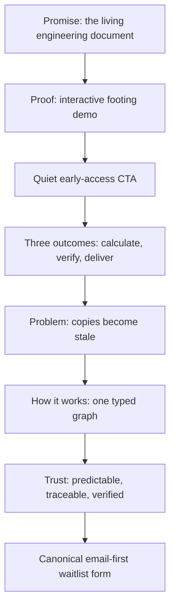

# feat: Refocus Landing Page on Product Proof

## Overview

Restructure the OctoMeta landing page around one proof: changing an engineering input updates the calculation, report, and 3D geometry as a single living document, with the verified model delivered through IFC. Keep the existing brand system and interactive footing demo, but shorten the mobile journey, consolidate overlapping sections, communicate the launch scope clearly, and make early-access signup simpler.

This plan adopts the brainstorm's recommended **Product Proof** direction. Its positioning is engineering certainty over AI hype: OctoMeta should feel familiar to the engineering design process and promise predictable behavior, quality, traceability, and verification. The engineering document, 3D geometry, and IFC are private-beta pillars; MCP and AI are subordinate “Coming soon” capabilities. This is an editorial and interaction refinement, not a rebrand and not a new product feature.

## Problem Statement

The current page has a distinctive visual system and a strong live demo, but the narrative repeats the same value proposition across persona, problem, graph, units, geometry, deliverables, review, connectors, and AI sections. At 390 × 844, the rendered page measured approximately 10,766 CSS px tall and the waitlist began around 9,305 px.

The implementation also diverges from documented rules in several small but cumulative ways:

- `src/lib/styles/base.css:118` uses logo-only `--accent-2` for value-chip text.
- `src/lib/styles/base.css:308` uses `transition: all`.
- `src/routes/+page.svelte:750` and `src/lib/components/HeroDemo.svelte:264` use shadows despite `DESIGN.md` prohibiting them.
- `src/lib/components/HeroDemo.svelte:386-416` provides only a 22 px range-control area with a 12–15 px thumb.
- `src/lib/components/Waitlist.svelte:72-145` asks for five data fields plus consent before signup.
- `src/lib/components/Waitlist.svelte:227-230` overrides the global focus outline with a more-specific `:focus` rule.
- `src/lib/actions/reveal.ts:1-31` progressively hides content after hydration; it needs explicit browser coverage for observer failure and reduced motion.

The page also presents future product vision beside current capability without a clear status boundary. `README.md:1-17` describes the current R1.6 workbench, while `PRD.md:74-94` defines later milestones. The landing page needs two unambiguous states: what the private-beta program includes—the engineering document, 3D geometry, and IFC—and what is “Coming soon,” specifically MCP and AI.

## Users and Jobs

- **Design engineer:** understand quickly whether OctoMeta removes re-authoring across calculations and reports.
- **Checker:** see unit safety, derivation, and provenance as concrete product behavior.
- **BIM/digital lead:** see 3D geometry and IFC delivery as core private-beta capabilities from the same traceable graph.
- **Beta prospect:** join early access with minimal friction and optionally provide qualification context.
- **Keyboard, touch, reduced-motion, and assistive-technology users:** receive equivalent content and operable controls.

## Proposed Information Architecture

### Content Decisions

1. **Promise**
   - Preserve the canonical vision statement from `PRD.md:13-15` and the hero lockup.
   - Add a concise positioning line that makes the priority explicit: predictable engineering software, not AI theatre. Final copy must remain engineer-to-engineer and avoid combative or trend-chasing language.
   - Name quality, traceability, and verification as product requirements, not optional benefits.
   - Keep one primary CTA and one demo link.
   - Remove the three persona paragraphs from the hero; their outcomes move into the post-demo strip.

2. **Proof**
   - Keep `HeroDemo.svelte` as the page's single bold moment.
   - Add a visible, concise instruction such as “Drag footing.B to recompute the document.”
   - Label it as a private-beta preview; do not describe geometry or IFC as speculative roadmap work.
   - Place a quiet “Join the private beta” anchor immediately after the demo. It links to the one canonical waitlist form; do not duplicate form state or backend submissions.

3. **Three Outcomes**
   - Consolidate persona and feature copy into **Calculate**, **Verify**, and **Deliver**.
   - Each outcome gets one sentence and one product-specific visual or datum, not a generic card.
   - Suggested mapping:
     - Calculate: graph ordering + typed units.
     - Verify: show steps + provenance.
     - Deliver: private-beta 3D geometry and IFC from the same traceable graph.

4. **Problem and Evidence**
   - Retain one concise stale-copy scenario.
   - Remove the current statistics unless direct, reviewable citations are added beside them. Do not retain “industry estimates” as an attribution.
   - Prefer demonstrable product facts over market statistics.

5. **How It Works**
   - Keep `GraphDiagram.svelte` and one explanation of dependency-ordered evaluation.
   - Fold units, provenance, and delivery examples into the three outcome chapters instead of maintaining separate full sections.

6. **Engineering Trust and Product Status**
   - Lead with three non-negotiable principles: **Predictable by construction**, **Traceable by default**, and **Verifiable at every step**.
   - Add a compact status panel with two explicit labels:
     - **Private beta:** authenticated documents, report canvas, workbook, parameters, equations, derivations/show steps, provenance, persistence, 3D geometry, and IFC delivery from the same dependency graph.
     - **Coming soon:** MCP connectivity and AI-assisted workflows.
   - Present 3D geometry and IFC in the hero proof and Deliver outcome, not only in the status panel. They are differentiators, not roadmap trivia.
   - Keep MCP and AI visually subordinate. Explain that future AI assists through the typed, traceable workflow; it never replaces deterministic calculation, verification, or engineering judgment.
   - Review every status claim against the beta commitment and write tense accordingly: “private beta” or “coming soon.”
   - Replace the long connector and AI sections with the concise “Coming soon” treatment; do not add another technical page in this issue.

7. **Early Access**
   - Keep a single `Waitlist.svelte` instance and existing `waitlist.join` mutation.
   - Make email and consent the only required decisions.
   - Put name, role, firm size, and current tool inside a collapsed, clearly optional “Tell us about your team” disclosure, or omit them from the initial version. Existing backend fields already accept `undefined`.
   - Preserve loading, failure, and success states; improve their announcement and focus behavior.

## User Flows and Edge Cases

### Primary Flows

1. **Explore and interact:** visitor reads promise → changes range value by pointer or keyboard → report value and geometry update → visitor reaches outcome summary.
2. **Convert from hero:** visitor activates hero CTA → browser navigates to `#waitlist` with sticky-nav clearance → email field remains discoverable and keyboard accessible.
3. **Convert after proof:** visitor activates post-demo CTA → same canonical waitlist target; no duplicate form or state.
4. **Submit:** visitor enters valid email, accepts consent, optionally expands qualification fields, submits, sees an announced success state.
5. **Recover from failure:** backend error leaves entered values intact, re-enables submission, announces a specific retry instruction, and keeps focus in a sensible location.
6. **Reduced motion:** all content is immediately visible; demo auto-loop and decorative entrance motion are disabled; manual range editing still updates values without animation.
7. **No IntersectionObserver:** page content remains visible and usable because reveal is progressive enhancement.

### Flow Permutations

| Context | Required behavior |
|---|---|
| Desktop pointer | Full two-pane demo, hover feedback, explicit instruction |
| Desktop keyboard | Logical tab order, visible focus, range arrow-key operation, skip link |
| 390 × 844 touch | No horizontal overflow, ≥44 px targets, compact demo, page ≤7,000 px after fonts settle |
| Reduced motion | No auto-loop, pulses, smooth scrolling, or hidden reveal state |
| JavaScript/observer failure | Semantic content remains visible; navigation anchors still work |
| Invalid email/unchecked consent | Inline/native error is reachable, described, and submission does not start |
| Backend failure | Values preserved, submit enabled again, polite announcement with retry instruction |
| Successful signup | One mutation, one success announcement, no duplicate-form ambiguity |

## Implementation Plan

### Phase 1 — Content Contract and Structure

- [x] In `src/routes/+page.svelte`, replace the hero persona block with the three-outcome summary placed after `HeroDemo`.
- [x] In `src/routes/+page.svelte`, add a quiet post-demo CTA linking to `#waitlist`.
- [x] Consolidate the current `why`, `units`, `geometry`, `deliverable`, and `review` material into the Promise → Proof → Outcomes → Problem → Graph → Trust → Waitlist sequence.
- [x] Remove the unsourced statistics at `src/routes/+page.svelte:112-133`, unless source links are supplied and reviewed before implementation.
- [x] Replace the long connector and AI sections at `src/routes/+page.svelte:298-382` with an engineering-trust section and concise “Coming soon” treatment.
- [x] Make 3D geometry and IFC visually prominent in the hero proof and Deliver outcome as private-beta capabilities.
- [x] Add the positioning message that predictable engineering behavior, quality, traceability, and verification take precedence over AI hype.
- [x] Update `src/lib/components/Nav.svelte` anchors and labels to match the final section IDs.
- [x] Preserve `DimDivider.svelte` as the section-separation motif, but renumber dividers after consolidation.
- [x] Keep section-specific markup in `+page.svelte` unless a section has independent behavior or is reused. Do not create generic marketing-card abstractions.

**Phase gate:** content review confirms every “private beta” and “coming soon” claim against `README.md`, `ARCHITECTURE.md`, the approved product plan, release tests, or another authoritative artifact. Geometry and IFC remain first-class beta commitments; MCP and AI remain subordinate.

### Phase 2 — Product Demo and Signup

- [x] In `src/lib/components/HeroDemo.svelte`, add visible interaction guidance and, if needed, a “Product preview” status label.
- [x] Increase the range input's layout hit area to at least 44 px in both axes while retaining the restrained 1 px track and brand ring thumb.
- [x] Verify Arrow Left/Right, Home, and End operation and expose the current value through native range semantics.
- [x] Retain computation-only recompute flashes and dependency pulses; remove shadow elevation and use border/surface contrast.
- [x] In `src/lib/components/Waitlist.svelte`, reduce the initial form to email + consent + submit.
- [x] Place optional qualification fields in one native `
` disclosure if product stakeholders still require them.
- [x] Use unique, stable IDs and preserve `name`, `type`, `autocomplete`, and existing optional payload mapping.
- [x] Add an `aria-live="polite"` status region for submission progress, retryable failure, and success; connect field-level errors using `aria-describedby` where custom text is used.
- [x] Keep the submit button enabled until submission starts, show “Joining…”, preserve values on error, and move focus only when it clarifies success or the first invalid field.

**Phase gate:** the live demo remains manually operable in reduced-motion mode, and one canonical waitlist submission reaches the unchanged persistence boundary.

### Phase 3 — Design-System and Accessibility Compliance

- [x] In `src/routes/+page.svelte`, add a first-focusable skip link targeting a stable `id="main-content"` on `<main>`.
- [x] In `src/lib/styles/base.css`, add the skip-link primitive and global `text-wrap: balance`/`pretty` rules where supported.
- [x] Replace `.btn { transition: all ... }` with explicit `background-color`, `border-color`, `color`, and `transform` declarations as applicable.
- [x] Change `.chip` text from `--accent-2` to an allowed accessible token; keep `--accent-2` logo-only.
- [x] Remove marketing shadows and represent elevation with `--surface`, `--grey-3`, and documented radii.
- [x] In `src/lib/components/Waitlist.svelte`, use `:focus-visible` without overriding the global outline and replace the one-off 16 px radius with `--radius-card` or `--radius-panel`.
- [x] Reconcile `src/lib/styles/tokens.css` typography and spacing additions with `DESIGN.md`; either restore documented values or update `DESIGN.md` in the same change with an explicit rationale. Do not silently maintain two token definitions.
- [x] Retain minimum AA contrast, the 8 px spacing system, paper background, one accent, and no dark-mode or Liquid Glass improvisation.
- [x] Replace generic scroll-reveal use with static presentation except where an entrance contributes to the product explanation. If `reveal` remains, add a timeout/failure-safe that removes `.pre` and cover it in browser tests.

**Phase gate:** targeted searches find no `transition: all`, landing-page `box-shadow`, or non-logo `var(--accent-2)` use; keyboard focus and reduced-motion behavior pass browser verification.

### Phase 4 — Browser Coverage and Visual Verification

- [x] Add `e2e/landing.spec.ts` for the desktop public landing page; it must not require an authenticated route.
- [x] Add `e2e/landing.narrow.spec.ts` for 390 × 844 coverage, following the existing narrow-workbench pattern in `e2e/workbench.narrow.spec.ts:1-36`.
- [x] Assert one H1, logical H2 order, a visible demo instruction, one canonical waitlist form, working hero/post-demo anchors, and no duplicate IDs.
- [x] Change the demo range by keyboard and assert dependent displayed values update.
- [x] Run axe on the initial page and after opening optional fields; require zero violations.
- [x] Assert `scrollWidth <= innerWidth`, range/form/control bounding boxes meet 44 px touch targets, and `document.documentElement.scrollHeight <= 7000` at 390 × 844 after `document.fonts.ready`.
- [x] Create a reduced-motion browser context and assert all content sections are visible, animations/transitions resolve to none, and the demo value does not auto-advance while manual input still works.
- [x] Simulate missing `IntersectionObserver` before navigation and assert section content remains visible.
- [x] Capture and inspect desktop (1440 × 900), tablet/resized, and mobile (390 × 844) screenshots at the hero, proof/outcomes, trust, and waitlist states.
- [x] Verify Safari/WebKit behavior for the range control, sticky navigation, focus, safe-area padding, and native `
`/form controls.

## Acceptance Criteria

### Narrative and Trust

- [x] Hero and demo communicate input → calculation/report/geometry recomputation without requiring the visitor to read later sections.
- [x] The page follows Promise → Proof → Outcomes → Problem → Graph → Trust → Waitlist.
- [x] Calculate, Verify, and Deliver each appear once as the primary outcome grouping.
- [x] Private-beta and “Coming soon” capabilities are visually and semantically distinct.
- [x] 3D geometry and IFC are unmistakable private-beta differentiators in both the hero proof and Deliver outcome.
- [x] MCP and AI appear only as subordinate “Coming soon” capabilities.
- [x] The page clearly states that predictable behavior, quality, traceability, and verification—not AI novelty—are OctoMeta's priorities.
- [x] No prominent unsourced quantitative claim remains.
- [x] The post-demo CTA and hero CTA both target the one canonical waitlist form.

### Design and Interaction

- [x] Existing paper, typography, dimension-divider, accent-punctuation, and computation motifs remain recognizable.
- [x] No stock imagery, mascot, off-brand gradient, Liquid Glass imitation, generic feature-card wall, or decorative scroll narrative is introduced.
- [x] No landing-page shadow or non-logo `--accent-2` use remains.
- [x] Motion only demonstrates computation and respects `prefers-reduced-motion`.
- [x] Mobile page height is no more than 7,000 CSS px at 390 × 844 after fonts settle, representing at least a 35% reduction from the measured baseline.

### Accessibility and Resilience

- [x] A visible-on-focus skip link targets `<main id="main-content">`.
- [x] Every interactive control has a visible `:focus-visible` state and a touch target of at least 44 × 44 CSS px where applicable.
- [x] Landing-page axe scans report zero violations at desktop and narrow viewports.
- [x] The page has no horizontal overflow at 390 px.
- [x] Reduced-motion and missing-observer scenarios expose all content.
- [x] Form failure and success states are announced, preserve appropriate state, and provide a clear next step.

### Quality Gates

- [x] `pnpm check`
- [x] `pnpm test`
- [x] `pnpm build`
- [x] `pnpm test:e2e`
- [x] `pnpm secret:scan`
- [x] `git diff --check`
- [x] Manual desktop, narrow, keyboard-only, reduced-motion, and WebKit/Safari review completed.

## SpecFlow Findings Incorporated

- **Duplicate conversion state:** resolved by one form and multiple anchors rather than two independent waitlist forms.
- **Vision versus shipped state:** resolved with “Private beta” and “Coming soon” labels plus claim-by-claim evidence review.
- **AI positioning:** resolved by making AI and MCP subordinate future capabilities while deterministic engineering behavior, traceability, and verification lead the message.
- **Reveal failure:** treated as a resilience requirement, not merely a screenshot artifact.
- **Optional qualification:** uses native disclosure and optional backend fields; email and consent remain the only required decisions.
- **Touch versus visual size:** the range track may remain visually delicate while its layout hit area reaches 44 px.
- **Mobile-length metric:** measured only after fonts settle at the existing Playwright narrow viewport to avoid ambiguous manual comparison.
- **Submission errors:** values persist, controls re-enable, and an announced retry path is required.

## Dependencies and Risks

| Risk | Impact | Mitigation |
|---|---|---|
| Copy confuses beta, launch, and future scope | Trust and reputational risk | Require explicit status labels and evidence review before phase 1 gate |
| Anti-hype language sounds combative or becomes hype itself | Brand voice loses precision | Use calm engineer-to-engineer copy and demonstrate predictable behavior instead of attacking competitors |
| Compression removes necessary technical credibility | Page feels generic | Keep one graph diagram and product-specific examples in each outcome |
| Fixed height threshold becomes brittle | CI flakes across rendering environments | Wait for fonts, use the existing Chromium viewport, and update threshold only with recorded before/after evidence |
| Simplified form reduces segmentation data | Beta prioritization is harder | Keep optional fields in one collapsed disclosure; backend remains unchanged |
| Reveal changes alter perceived polish | Page feels static | Preserve computation motion and use hierarchy/spacing rather than generic entrances |
| Global token fixes affect the authenticated workbench | Unintended UI regression | Run full unit/E2E suite and visually inspect chips/focus in the app shell |
| WebKit range styling differs | Touch or focus regression | Include explicit WebKit/Safari verification before completion |

## Out of Scope

- Implementing the underlying 3D geometry, IFC, MCP, or AI product capabilities as part of this landing-page issue. Geometry and IFC remain private-beta commitments; MCP and AI remain “Coming soon.”
- Adding analytics, experimentation infrastructure, or conversion tracking.
- Creating a separate product, technical, roadmap, or documentation page.
- Rebranding, changing the logo, adding dark mode, or introducing new fonts/colors.
- Changing the waitlist mutation/schema or email-delivery backend unless testing exposes an existing defect.
- Creating a scroll-controlled or parallax product story.

## Institutional Learning

Only one solution document exists under `docs/solutions/`, and it concerns stale Svelte presentation identities in the authenticated workbook. It is not directly applicable to the static landing-page restructuring. Its transferable testing lesson is retained: browser tests should assert the rendered accessibility tree and visible state rather than only internal return values.

No `docs/solutions/patterns/critical-patterns.md` file exists in the current repository.

## References

### Internal

- `docs/brainstorms/2026-07-21-landing-page-enhancement-brainstorm.md`
- `DESIGN.md:145-244` — tokens, motion, and application rules
- `PRD.md:13-45` — canonical vision, product thesis, personas, and milestones
- `README.md:1-68` — current R1.6 product and verification evidence
- `src/routes/+page.svelte:24-394` — current landing content structure
- `src/lib/components/HeroDemo.svelte:100-492` — interaction, motion, and responsive demo
- `src/lib/components/Waitlist.svelte:27-296` — canonical signup state and form
- `src/lib/styles/base.css:10-365` — shared typography, focus, motion, and button primitives
- `src/lib/styles/tokens.css:1-58` — implemented design tokens
- `src/lib/actions/reveal.ts:1-31` — current progressive reveal behavior
- `e2e/workbench.narrow.spec.ts:1-36` — narrow viewport and axe pattern

### External

- [Apple Human Interface Guidelines — Layout](https://developer.apple.com/design/human-interface-guidelines/layout)
- [Apple UI Design Dos and Don’ts](https://developer.apple.com/design/tips/)
- [Vercel Web Interface Guidelines](https://github.com/vercel-labs/web-interface-guidelines)

## Handoff

Implement this as one cohesive landing-page change, in phase order. Lead with predictable engineering behavior, quality, traceability, verification, 3D geometry, and IFC as one private-beta program. Keep MCP and AI in a restrained “Coming soon” position.

## Completion Evidence

- `pnpm check`: 0 errors and 0 warnings.
- `pnpm test`: 25 files and 534 tests passed.
- `pnpm build`: production build passed.
- `pnpm test:e2e`: 10 tests passed across Chromium desktop/narrow and WebKit.
- Desktop and narrow axe scans: zero violations.
- Narrow layout: no horizontal overflow, 44 px range target, and page height below 7,000 CSS px at 390 × 844.
- `pnpm secret:scan` and `git diff --check`: passed.
- Final screenshots inspected at 1440 × 900, 768 × 1024, and 390 × 844.
