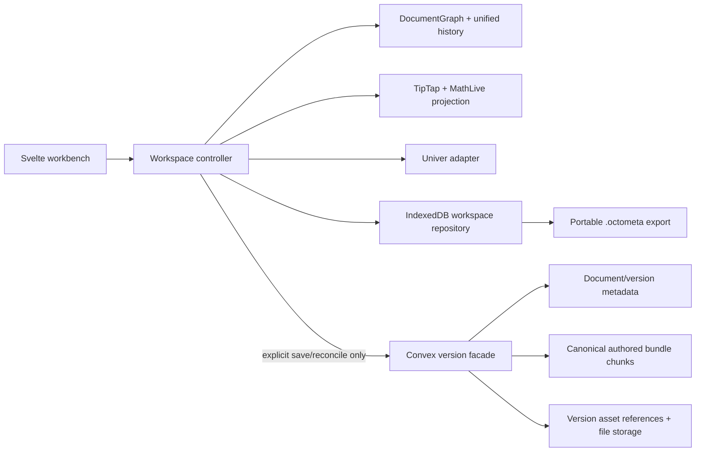
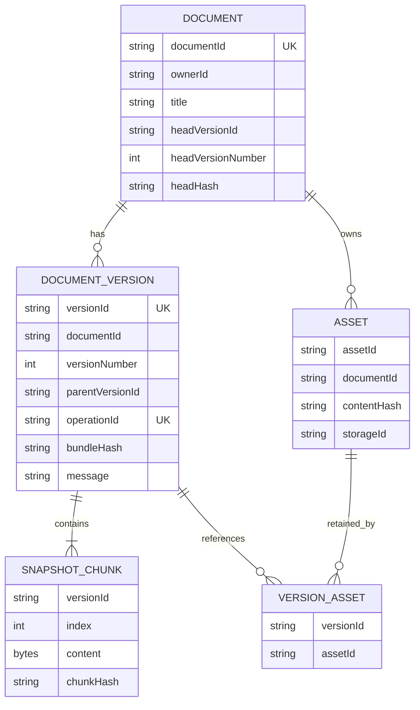

# feat: Rebuild the local-first document workspace

## Overview

Replace the glitch-prone prototype workbench with a browser-first technical-document workspace. Every accepted edit is durable in IndexedDB, while Convex receives authored content only through an explicit **Save new version** or reconciliation action. The document becomes a two-level notebook of visible blocks and section containers, attached to one independently scrollable workbook. Equations use direct visual math editing with composable references to explicitly published workbook values. Images are imported locally, resizable and alignable, then uploaded only when referenced by an explicit cloud save.

This plan incorporates the decisions in `CONTEXT.md` and ADRs 0001–0016. It supersedes the earlier persistence plan where that plan assumes legacy-data migration, a flat block sequence, the old static/single-bound equation union, or a separate parameters rail.

## Outcomes

- Ordinary editing, workbook changes, undo/redo, images, and document creation make zero Convex product writes.
- New documents exist only in IndexedDB until their first explicit cloud save.
- The UI distinguishes local durability from cloud version state.
- Cloud history consists of immutable authored snapshots and excludes undo/UI state.
- Equations retain focus, edit visually, and mix authored math with multiple stable live references.
- Published values are discoverable and managed from the workbook.
- Images work from file selection, drag-and-drop, and clipboard paste.
- The workbook is a resizable right drawer and never prevents document scrolling.
- The obsolete toolbar and Parameters rail are removed.
- Sections are visible, collapsible notebook containers with one level of child blocks.
- A `/` menu provides Notion-like block insertion without replacing TipTap.
- Git-like local branches, conservative reconciliation, and forward-only restore are available.
- Searchable offline help, contextual tooltips, toasts, and a reviewable activity panel explain behavior.

## Non-goals

- Literal Git repositories or Git object storage.
- Realtime collaborative editing, presence, or collaborative undo.
- Automatic cloud sync on edit or reconnect.
- Arbitrary cell references in document content.
- Published cell ranges/tables in this release; preserve the model extension point only.
- Charts, geometry viewers, comments, review workflows, or arbitrary nested sections.
- Automatic cell-level merging when both branch and main changed the workbook.
- Migrating prototype document data from the current Convex deployment.

## Current-state evidence

- `src/lib/persistence/saver.ts:1-14` explicitly describes the current 500 ms full-graph cloud save, including undo and chips.
- `src/lib/persistence/client.ts:113-129` serializes the complete graph and calls `documents.save`; `src/lib/persistence/client.ts:138-154` uploads images before insertion.
- `src/routes/app/[docId]/+page.svelte:146-185` sends mutations and undo/redo through the cloud saver.
- `src/routes/app/[docId]/+page.svelte:188-213` requires a Convex upload before an image block can exist.
- `src/routes/app/[docId]/+page.svelte:423-507` owns the obsolete Undo/Redo/Move/Image/Sheet/Parameters toolbar and ambiguous `saved` label.
- `src/lib/editor/equation-node.ts:135-171` creates mutually exclusive static/bound controls and a textarea; lines 255-338 require apply-style behavior that is vulnerable to NodeView repaint/focus churn.
- `src/routes/app/[docId]/WorkbookDrawer.svelte` is a fixed bottom panel with a fixed expanded height, coupling document viewport space to workbook visibility.
- `src/convex/schema.ts:86-156` normalizes documents into graph, block, undo, workbook, chip, and asset rows.
- The repository has no IndexedDB workspace adapter today.

## Institutional learning

Apply `docs/solutions/ui-bugs/tab-rename-stays-stale-workbook-adapter-20260720.md` throughout:

- keep `DocumentGraph` framework-neutral;
- identify sheets, blocks, sections, published values, assets, workspaces, and versions with stable IDs;
- project engine state into fresh Svelte view objects at explicit settle boundaries;
- assert browser-visible and accessibility-tree outcomes, not only adapter return values.

## Canonical user flows

### Create and edit locally

1. The authenticated owner creates a document from the unified index.
2. The app generates a product document ID and creates a local `main` working copy in IndexedDB; Convex receives no document mutation.
3. Edits update the graph and unified undo history, then enter the local autosave queue.
4. The UI shows **Saving locally…** and only shows **Stored on this device** after the IndexedDB transaction commits.
5. A failed transaction leaves the working copy dirty, raises a persistent error toast/activity event, and offers retry/export guidance.

### Save cloud version 1 or N+1

1. The owner clicks **Save new version** or presses Cmd/Ctrl+S.
2. The controller flushes editor changes, workbook callbacks, and local persistence into one captured generation.
3. A dialog shows the next version, change summary, warnings, assets to upload, and optional version message.
4. Missing assets or corrupt serialization block saving; incomplete formulas and broken references warn but remain saveable.
5. Referenced local assets upload/finalize, then one idempotent compare-and-swap mutation creates the immutable version and advances main.
6. Success updates only sync metadata for the captured generation; edits made during upload remain dirty and are never overwritten.

### Author blocks and sections

1. `/` at a valid insertion point opens a keyboard-accessible block menu.
2. Initial choices are text, heading, section, equation, and image.
3. Each visible block exposes contextual move/delete controls; image blocks also expose alignment and resize controls.
4. A section owns one ordered level of child blocks and supports collapse, move, delete, and undo as a group.
5. Drag/drop, keyboard movement, and undo preserve stable IDs and valid section containment.

### Edit equations and insert live references

1. Clicking an equation enters a MathLive mathfield without losing focus.
2. `input` updates a draft visual expression; valid changes enter unified history and local autosave without an Apply requirement.
3. **Insert live reference** opens the searchable published-values picker at the mathfield cursor.
4. A selected reference inserts a stable reference token while rendering its current name/value/notation.
5. Rename preserves the token target. Unpublish discloses uses and leaves a visible repairable broken reference if confirmed.
6. Escape restores the state captured when edit mode began; Cmd/Ctrl+Enter merely finishes editing.

### Publish workbook values

1. Select a workbook cell and choose **Publish value**.
2. Enter a unique semantic name plus optional label, unit, and description.
3. The workbook's searchable published-values panel lists name, current value, unit, sheet, and cell.
4. Selecting an entry activates its source sheet/cell. Rename and unpublish operate by stable published-value ID.
5. When no values exist, equation/prose pickers explain the state and deep-link to the publish action.

### Work with images

1. Insert through file picker, drag/drop, or clipboard.
2. Validate MIME signature, supported type, decoded dimensions, and configured byte/pixel limits before accepting.
3. Store a stable asset record and blob in the same IndexedDB transaction as the first generation that references it.
4. Render through a revocable object URL; preserve aspect ratio while resizing within the document width.
5. Persist left/center/right alignment, display width, alt text, and caption in authored content.
6. Upload only assets reachable from the captured cloud-save generation.

### Workbook layout

1. Desktop uses a right drawer separated by a keyboard- and pointer-operable resize handle.
2. Document and workbook scroll independently; width is a local preference and collapse restores document width.
3. Focus mode temporarily expands the workbook.
4. Narrow layouts use a full-screen workbook overlay with an explicit return-to-document action and restored focus.

### Branch and reconcile

1. Create a named local branch from current main or a historical version, retaining a complete local base snapshot and fresh undo history.
2. Edit and autosave locally without cloud branch writes.
3. Reconcile with a three-way comparison: branch base, current main, and branch authored state.
4. Auto-merge independent blocks and independent published-value metadata; same-block changes require resolution; concurrent workbook edits are one explicit conflict.
5. A successful reconciliation creates the next immutable main version.
6. The branch becomes read-only **Reconciled with main vN** until continued from that main version or deleted.

### Help and feedback

1. `/app/help` provides searchable, task-based documentation bundled with the application and available offline.
2. Empty states, warnings, and errors deep-link to the relevant topic.
3. Tooltips name or clarify unfamiliar controls but never contain critical state.
4. Success toasts dismiss automatically; warnings/errors remain until acknowledged or resolved.
5. Significant session events remain reviewable in the activity panel and are announced accessibly without stealing focus.

## Architecture



### Ownership boundaries

| Concern | Owner | Excluded state |
|---|---|---|
| Typed calculations, block hierarchy, publication identity | `DocumentGraph` | Svelte runes, Convex IDs |
| Prose/document projection | TipTap adapter | persistence calls |
| Visual equation input | MathLive NodeView adapter | cloud saving |
| Spreadsheet projection | Univer adapter | document layout decisions |
| Working copy, undo, local assets, branches | IndexedDB repository | cloud authorization |
| Immutable versions, ownership, assets, history | Convex facade/backend | undo and UI preferences |
| Toasts/activity/help routing | application services/components | domain mutations |

### Authored bundle

```ts
interface AuthoredDocumentBundle {
  schemaVersion: number;
  documentId: string;
  title: string;
  rootBlocks: BlockId[];
  blocks: Record<BlockId, AuthoredBlock>;
  graph: AuthoredGraphPayload;
  workbook: { manifest: WorkbookManifest; snapshot: unknown };
  assetManifest: Array<{ assetId: string; hash: string; type: string; size: number }>;
}

type AuthoredBlock =
  | TextBlock
  | HeadingBlock
  | SectionBlock
  | EquationBlock
  | ImageBlock;

interface SectionBlock {
  id: BlockId;
  type: 'section';
  title: string;
  childBlockIds: BlockId[];
}

interface EquationBlock {
  id: BlockId;
  type: 'equation';
  expression: EquationExpression;
}

interface EquationExpression {
  segments: Array<
    | { type: 'latex'; value: string }
    | { type: 'publishedValue'; publishedValueId: string; fallbackLabel: string }
  >;
}
```

Section collapse is a local UI preference and is excluded from authored/cloud/portable bundles. The stable reference token must never depend on rendered LaTeX, current display name, or cell address.

### IndexedDB stores

Use the current stable `idb` release after re-verifying it immediately before implementation. Keep native transaction/store concepts visible behind `$lib/persistence/local/`.

| Store | Key | Purpose |
|---|---|---|
| `profiles` | `accountId` | namespace/schema/deletion state |
| `workspaces` | `[accountId, documentId, workspaceId]` | current bundle, undo, base ref, generations, durability metadata |
| `baseSnapshots` | `[accountId, documentId, authoredHash]` | immutable three-way merge bases |
| `assets` | `[accountId, documentId, assetId]` | local blob, hash, MIME, cloud binding |
| `documentSummaries` | `[accountId, documentId]` | unified index metadata |
| `pendingOperations` | `[accountId, operationId]` | idempotent explicit save/reconcile payload |
| `preferences` | `[accountId, key]` | drawer width and non-authored UI preferences |

Workspace content plus undo commits atomically with expected-generation compare-and-swap. An asset insertion and first referencing generation use one multi-store transaction. Use a 500 ms trailing delay, a 2 s maximum dirty interval, immediate flushes at semantic boundaries, and visible quota/transaction failure.

### Cloud model



- Canonicalize one complete authored bundle per version.
- Store one chunk when safely below the current Convex 1 MiB document limit; target approximately 700 KiB and split only as necessary.
- Verify per-chunk hashes, byte length, contiguous indexes, and complete SHA-256 on load.
- Keep document metadata, version metadata, version-asset reachability, and assets separately indexed.
- Do not create cloud rows for individual graph nodes, blocks, chips, equations, workbook cells, undo entries, or branches.
- Use product ULIDs outside the Convex adapter; never leak Convex `_id` as domain identity.
- Enforce owner authorization and expected-head compare-and-swap in every version mutation.
- Persist `operationId` plus input hash so a committed request with a lost response cannot create a duplicate version.

## Implementation phases

### Phase 0 — Safety and executable reset

- [ ] Add a deployment-scoped, product-table allowlisted maintenance reset that cannot address Better Auth component tables.
- [ ] Count and report all targeted product rows and file-storage objects before deletion.
- [ ] Preserve Better Auth users/accounts/credentials/verifications/sessions and the `waitlist` table.
- [ ] Delete current documents, graph nodes, blocks, undo rows, workbook snapshots, chip bindings, document assets, version/access/migration records, and obsolete maintenance-job records after the reset completes.
- [ ] Require explicit environment name, reset token, and typed acknowledgement; run only after the new client/backend compatibility boundary is deployable.
- [ ] Verify product tables/storage are empty and preserved auth/waitlist counts are unchanged.

Gate: a dry run proves the exact target set; the destructive run is auditable, bounded, and cannot delete authentication or waitlist data.

### Phase 1 — Local persistence foundation

- [ ] Add `$lib/persistence/local/db.ts`, schema migrations, repository contracts, generation CAS, and account namespaces.
- [ ] Split local serialization from cloud serialization; local bundle includes undo, cloud/portable bundles cannot encode it.
- [ ] Replace `DocumentSaver` with a local autosave controller and independent cloud-version controller.
- [ ] Add quota estimation, persistent-storage request, transaction-failure recovery, and export guidance.
- [ ] Add Web Locks edit lease plus BroadcastChannel saved-generation/takeover notifications.
- [ ] Add local-only document creation and the unified document index.
- [ ] Add service-worker support for app-shell/help and previously opened owner workspaces without automatic cloud synchronization.

Gate: create/edit/reload/undo/image workflows survive offline reload with zero Convex product mutations.

### Phase 2 — Immutable cloud versions and explicit save

- [ ] Add additive document/version/chunk/asset-reference schema and indexes.
- [ ] Implement canonical authored projection, SHA-256 integrity, bounded chunking, idempotent operation receipts, and expected-head CAS.
- [ ] Implement staged asset upload/finalization reachable only from explicit version operations.
- [ ] Add **Save new version** dialog, optional message, warning summary, no-change result, retry, and Cmd/Ctrl+S behavior.
- [ ] Add distinct local and cloud status models to the header and unified index.
- [ ] Remove legacy save calls from every mutation, undo/redo, editor, workbook, and lifecycle callback.
- [ ] Ensure `pagehide` is best effort and never evidence of durability.

Gate: normal editing produces no Convex product function calls; one explicit save creates at most one verified immutable version and never uploads undo.

### Phase 3 — Images

- [ ] Replace `storageId`-first image payloads with stable local `assetId` references.
- [ ] Support picker, drag/drop, and clipboard input with signature/type/size/dimension validation.
- [ ] Add object-URL lifecycle management and missing-blob recovery UI.
- [ ] Add accessible resize handles, width bounds, aspect-ratio preservation, and left/center/right alignment.
- [ ] Add alt/caption editing and warnings for missing alt text without blocking draft saves.
- [ ] Upload only reachable assets during explicit save and preserve immutable version reachability.

Gate: images insert immediately offline, survive reload/undo, and upload exactly once when first cloud-referenced.

### Phase 4 — Workbench shell and workbook publication

- [ ] Replace the fixed bottom drawer with a right drawer, accessible separator, independent scroll containers, collapse/focus states, and local width preference.
- [ ] Preserve full-screen narrow-layout behavior and deterministic focus return.
- [ ] Replace the obsolete toolbar with the compact document header.
- [ ] Move block actions to contextual chrome and overflow/keyboard commands.
- [ ] Remove `ParametersRail.svelte` and its toolbar control.
- [ ] Add workbook publish-value action and searchable manager using stable publication IDs.
- [ ] Provide rename/unpublish usage disclosure, broken-reference creation, navigation to source cell, and empty-state help.

Gate: opening/resizing the workbook never traps document scrolling; published values are understandable and reachable without prior knowledge.

### Phase 5 — Direct visual equations

- [ ] Re-verify and add the latest stable MathLive package; retain KaTeX only where static/read-only rendering remains useful.
- [ ] Replace the static/bound payload with versioned expression segments containing stable reference tokens.
- [ ] Build a focus-safe TipTap NodeView around `<math-field>` with direct input, edit-session rollback, and controlled projection updates.
- [ ] Add searchable live-reference insertion at the mathfield cursor and optional raw-TeX mode.
- [ ] Render broken references visibly and accessibly without flattening them to text.
- [ ] Keep malformed/large input limits, trust-disabled rendering, accessible math output, and last-valid read preview.
- [ ] Add regression coverage for click focus, dropdown interaction, typing, undo, rename, unpublish, remount, and local reload.

Gate: the two reported focus/dropdown failures reproduce in a pre-fix test and pass through actual browser interaction after the rebuild.

### Phase 6 — Notebook sections and slash menu

- [ ] Add `section` to engine block types with one-level child ordering and containment invariants.
- [ ] Implement nested TipTap section NodeView/content schema; prohibit sections inside sections.
- [ ] Add visible notebook boundaries, child insertion points, collapse, group move/delete, and unified undo.
- [ ] Add the exact-version `@tiptap/suggestion` dependency and a custom Svelte `/` menu; do not depend on TipTap's experimental slash-command example.
- [ ] Support keyboard search/navigation/select/cancel, pointer selection, empty states, and correct focus restoration.
- [ ] Ensure block operations remain engine mutations and TipTap remains a projection.

Gate: section hierarchy round-trips through local/cloud/portable serialization and all block operations preserve valid containment.

### Phase 7 — Branching, reconciliation, history, and portability

- [ ] Create local branches from head/history with stable IDs, names, retained base snapshots, and fresh undo.
- [ ] Implement authored-state three-way diff excluding computed values, undo, selection, and local UI preferences.
- [ ] Auto-merge independent block/publication changes; require explicit same-block and workbook conflict resolution.
- [ ] Mark successful branches reconciled/read-only and support continue/delete.
- [ ] Add read-only history, branch-from-history, and restore-to-working-copy; all cloud outcomes create forward versions.
- [ ] Implement bounded self-contained `.octometa` export/import with assets, hashes, format version, and hostile-archive limits; exclude undo.
- [ ] Add sign-out resolution flow and resumable account-namespace deletion.

Gate: stale devices cannot overwrite head, reconciliation never silently chooses a side, restore never rewinds history, and exported documents recover after local data loss.

### Phase 8 — Help, feedback, and cleanup

- [ ] Add version-controlled help content and searchable `/app/help` route bundled into offline assets.
- [ ] Cover documents, blocks, sections, workbook, publication, equations, images, local/cloud durability, branches, recovery, shortcuts, accessibility, and troubleshooting.
- [ ] Add contextual help links from empty/error/warning states and restrained accessible tooltips.
- [ ] Add a shared toast service and session activity store with severity-specific dismissal behavior.
- [ ] Ensure `aria-live` announcements do not duplicate, steal focus, or overwhelm screen readers.
- [ ] Remove legacy normalized Convex schema/functions only after the reset and new version path are verified.
- [ ] Update `ARCHITECTURE.md`, `SCHEMA.md`, `README.md`, and affected help topics in the same changes that alter behavior.

Gate: core help works offline, significant outcomes remain reviewable for the session, and no obsolete product save/schema path remains callable.

## Acceptance criteria

### Persistence and cloud isolation

- [ ] A 10-minute mixed editing session—including typing, equations, cell edits, publication changes, images, section moves, undo, and redo—produces zero Convex product writes until explicit save.
- [ ] IndexedDB shows account-scoped workspaces, assets, generations, and undo state; UI durability labels match committed transactions.
- [ ] Reload restores the latest committed generation and unified undo cursor.
- [ ] Local failures never display **Stored on this device** and provide retry/export recovery.
- [ ] Cloud bundles and portable files structurally reject undo fields.

### Cloud versions

- [ ] First save creates document main v1; later changed saves advance exactly one version; no-change saves create none.
- [ ] Retry after a lost response is idempotent.
- [ ] A stale base cannot overwrite a newer head.
- [ ] Invalid/missing assets block saving; incomplete formulas and broken references warn but may save.
- [ ] Every loaded version verifies chunks, size, bundle hash, authorization, and referenced assets before becoming readable.

### Editor and workbook

- [ ] Equation input retains focus across typing and reference-picker interaction and never becomes a normal text node.
- [ ] Published-value pickers enumerate only explicit publications with name/value/unit/source.
- [ ] Renames preserve references; confirmed unpublish leaves repairable broken references.
- [ ] Image insertion works from all three sources, remains local before save, and persists size/alignment.
- [ ] Desktop document/workbook scrolling is independent; pointer and keyboard resizing work; narrow layout has no overflow trap.
- [ ] Toolbar and Parameters rail are absent; contextual actions and `/` menu cover their valid replacements.
- [ ] Sections visibly contain child blocks and undo group operations correctly.

### Branching and recovery

- [ ] Only one tab edits a working copy; cooperative takeover flushes and transfers ownership.
- [ ] Branches are device-local, survive reload, and never upload automatically.
- [ ] Reconciliation follows the agreed conservative conflict boundaries.
- [ ] Historical versions are read-only; restore and reconciliation advance main rather than rewinding it.
- [ ] Sign-out cannot strand dirty work silently and removes the resolved account namespace.

### Guidance and accessibility

- [ ] `/app/help` is searchable, keyboard accessible, deep-linkable, and available offline.
- [ ] Critical information is present in persistent UI or activity history, never only a tooltip/toast.
- [ ] Toast and activity behavior meets dismissal and `aria-live` rules.
- [ ] Axe checks pass for the workbench, save dialog, conflict resolver, image controls, slash menu, workbook drawer, activity panel, and help center.

## Test plan

### Unit and fake IndexedDB

- Local schema open/upgrade/block/versionchange, transaction abort, quota error, generation CAS, and namespace deletion.
- Local/cloud/portable codec separation and migration fixtures.
- Authored canonicalization, chunk boundaries, hashes, operation idempotency, and no-undo validation.
- Section containment and block operations.
- Equation segment editing, stable-token rename/unpublish/repair, and escaping/limits.
- Three-way merge permutations and workbook conflict unit.
- Toast/activity retention and dismissal reducers.

### Convex tests

- Owner authorization, stable product IDs, version uniqueness, CAS, idempotent retries, no-change saves, limits, and atomic rollback.
- Chunk integrity, asset staging/finalization/reachability, failed upload cleanup, and history retention.
- Reset dry-run/execute allowlist proving Better Auth and waitlist preservation.
- Assert absence of graph/block/chip/undo/workbook-cell child writes in versioned mode.

### Playwright

- Local-only create/edit/reload/offline and browser storage inspection.
- Explicit v1/v2 save, warning confirmation, retry, mid-upload edit, and stale-head rejection.
- Exact equation focus/dropdown/typing regression from the supplied screenshots.
- Publish/select/rename/unpublish/repair value flows.
- File/drop/paste images, resize/alignment, reload, undo, and explicit upload.
- Section creation/nesting prohibition/collapse/move/delete/undo and slash-menu keyboard behavior.
- Workbook desktop resizing/independent scrolling and narrow full-screen return focus.
- Branch/reconcile/conflict/history/restore/export/import/sign-out flows.
- Help search/offline/deep links, tooltip accessibility, toast dismissal, and activity review.

### Operational verification

- Instrument product function calls in development and prove no cloud write occurs during ordinary editing.
- Measure local capture/commit latency and keep editor interaction responsive at configured maximum bundle/image sizes.
- Verify one explicit save reads/writes only bounded version chunks and referenced assets.
- Run type checks, Vitest projects, production build, Playwright, dependency audit, and secret scan before rollout.

## Risks and mitigations

| Risk | Mitigation |
|---|---|
| Old client continues normalized writes | Deploy compatibility guard first; reject legacy writes in versioned mode and remove old callbacks before reset. |
| IndexedDB eviction/quota loss | Request persistent storage, estimate quota, surface failures, and provide portable export. |
| Save captures mixed editor/workbook generations | Explicit capture barrier drains editor and workbook queues before canonical serialization. |
| Edits during cloud upload are overwritten | Bind save result to captured generation and patch only sync metadata. |
| MathLive tokens flatten or corrupt references | Store structured stable tokens outside rendered LaTeX and test every edit boundary. |
| Nested TipTap model destabilizes engine order | Limit hierarchy to one level, validate containment in engine, and keep TipTap a projection. |
| Blob/object URL leaks | Centralize URL creation/revocation at asset and NodeView lifecycles. |
| Duplicate or noisy notifications | Event IDs, severity rules, coalescing, and separate transient toast/reviewable activity views. |
| Destructive reset touches users | Hardcoded product allowlist, dry-run counts, environment/token/acknowledgement gates, and post-run preserved-count assertions. |

## Documentation deliverables

- Update `CONTEXT.md` only when vocabulary changes.
- Keep ADRs 0001–0016 as the rationale record; add ADRs only for newly discovered hard-to-reverse trade-offs.
- Rewrite `ARCHITECTURE.md` runtime flow and ownership table.
- Replace normalized persistence sections in `SCHEMA.md` with local/authored/cloud/portable contracts.
- Update `README.md` setup, local storage inspection, explicit-save behavior, reset procedure, and offline limitations.
- Add `/app/help` source topics and a contributor rule that behavior changes update their linked topic.
- Compound confirmed implementation pitfalls under `docs/solutions/` after each phase.

## References

### Internal

- `CONTEXT.md`
- `docs/adr/0001-local-first-document-creation.md` through `docs/adr/0016-reset-prototype-product-data-without-migration.md`
- `docs/brainstorms/2026-07-21-browser-first-versioned-persistence-brainstorm.md`
- `docs/plans/2026-07-21-feat-browser-first-versioned-persistence-plan.md`
- `docs/solutions/ui-bugs/tab-rename-stays-stale-workbook-adapter-20260720.md`
- `DESIGN.md`

### External

- [Convex limits](https://docs.convex.dev/production/state/limits)
- [Tiptap suggestion utility](https://tiptap.dev/docs/editor/api/utilities/suggestion)
- [Tiptap experimental slash-command example](https://tiptap.dev/docs/examples/experiments/slash-commands)
- [Tiptap nested NodeViews](https://tiptap.dev/docs/guides/nested-node-view-content)
- [MathLive getting started](https://mathlive.io/mathlive/guides/getting-started/)
- [MathLive interaction guide](https://mathlive.io/mathlive/guides/interacting/)
- [idb repository](https://github.com/jakearchibald/idb)
- [CalcTree product model](https://www.calctree.com/)

## Definition of done

- All acceptance criteria and quality gates pass.
- The supplied equation and toolbar failures have automated browser regressions.
- Browser storage visibly contains durable working data; Convex contains only explicit immutable versions and version-reachable assets.
- Current prototype product data is removed from the intended deployment while Better Auth users and the waitlist remain intact.
- No legacy cloud autosave, normalized child-row, cloud undo, pre-upload image, Parameters rail, or obsolete toolbar path remains reachable.
- Help documentation accurately describes every shipped workflow and works offline.
